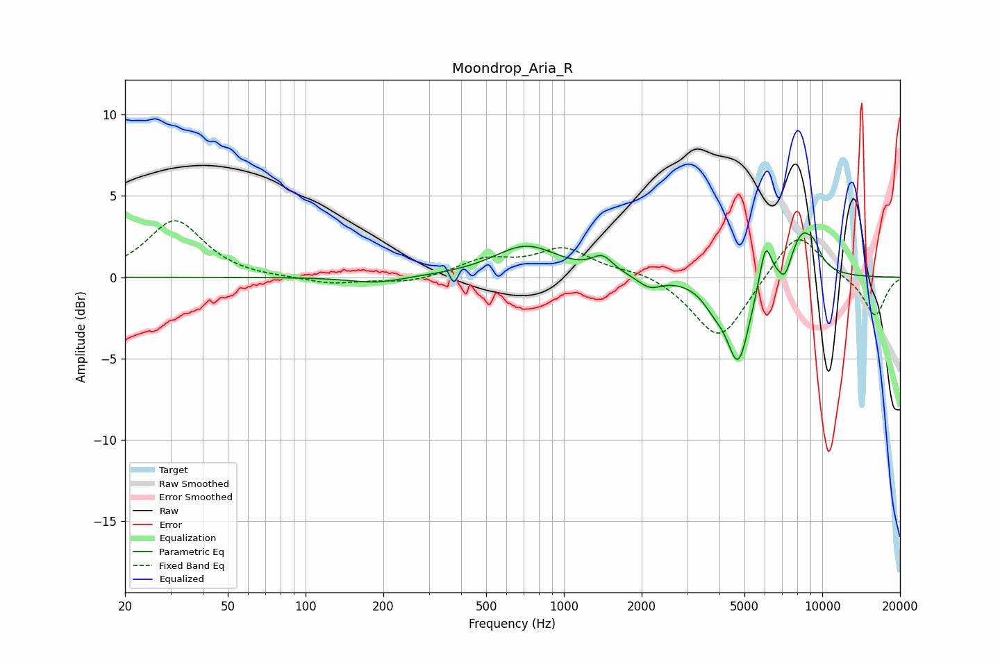

# Moondrop_Aria_R
See [usage instructions](https://github.com/jaakkopasanen/AutoEq#usage) for more options and info.

### Parametric EQs
Apply preamp of -2.8 dB when using parametric equalizer.

|   # | Type    |   Fc (Hz) |    Q |   Gain (dB) |
|-----|---------|-----------|------|-------------|
|   1 | Peaking |       188 | 1.38 |        -0.4 |
|   2 | Peaking |       714 | 1.13 |         1.9 |
|   3 | Peaking |      1410 | 3.49 |         1   |
|   4 | Peaking |      2148 | 3.09 |        -0.7 |
|   5 | Peaking |      3811 | 3    |        -1   |
|   6 | Peaking |      4730 | 3.12 |        -5.1 |
|   7 | Peaking |      6030 | 5.99 |         2.6 |
|   8 | Peaking |      7177 | 5.98 |        -1.1 |
|   9 | Peaking |      8395 | 2.51 |         2.9 |
|  10 | Peaking |      9349 | 6    |         0.6 |

### Fixed Band EQs
When using fixed band (also called graphic) equalizer, apply preamp of **-3.6 dB** (if available) and set gains manually with these parameters.

|   # | Type    |   Fc (Hz) |    Q |   Gain (dB) |
|-----|---------|-----------|------|-------------|
|   1 | Peaking |        31 | 1.41 |         3.5 |
|   2 | Peaking |        62 | 1.41 |        -0.1 |
|   3 | Peaking |       125 | 1.41 |        -0.4 |
|   4 | Peaking |       250 | 1.41 |        -0.4 |
|   5 | Peaking |       500 | 1.41 |         1   |
|   6 | Peaking |      1000 | 1.41 |         1.7 |
|   7 | Peaking |      2000 | 1.41 |         0.4 |
|   8 | Peaking |      4000 | 1.41 |        -4   |
|   9 | Peaking |      8000 | 1.41 |         3   |
|  10 | Peaking |     16000 | 1.41 |        -2.4 |

### Graphs

