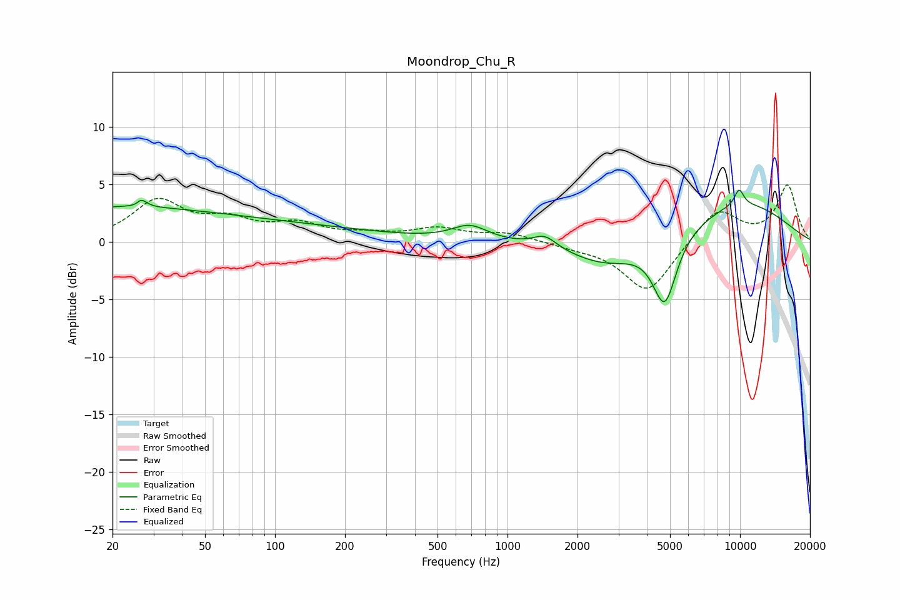

# Moondrop_Chu_R
See [usage instructions](https://github.com/jaakkopasanen/AutoEq#usage) for more options and info.

### Parametric EQs
Apply preamp of -4.6 dB when using parametric equalizer.

|   # | Type    |   Fc (Hz) |    Q |   Gain (dB) |
|-----|---------|-----------|------|-------------|
|   1 | Peaking |        20 | 0.26 |         2.9 |
|   2 | Peaking |        26 | 5.96 |        -2.5 |
|   3 | Peaking |        26 | 5.97 |         3.1 |
|   4 | Peaking |       152 | 0.44 |         0.8 |
|   5 | Peaking |       689 | 1.85 |         1.3 |
|   6 | Peaking |      1448 | 2.83 |         1   |
|   7 | Peaking |      2657 | 0.89 |        -2.1 |
|   8 | Peaking |      4744 | 2.72 |        -6   |
|   9 | Peaking |      9913 | 5.97 |         1.4 |
|  10 | Peaking |     10000 | 0.51 |         3.4 |

### Fixed Band EQs
When using fixed band (also called graphic) equalizer, apply preamp of **-5.0 dB** (if available) and set gains manually with these parameters.

|   # | Type    |   Fc (Hz) |    Q |   Gain (dB) |
|-----|---------|-----------|------|-------------|
|   1 | Peaking |        31 | 1.41 |         3.4 |
|   2 | Peaking |        62 | 1.41 |         1.6 |
|   3 | Peaking |       125 | 1.41 |         1.3 |
|   4 | Peaking |       250 | 1.41 |         0.5 |
|   5 | Peaking |       500 | 1.41 |         1   |
|   6 | Peaking |      1000 | 1.41 |         0.7 |
|   7 | Peaking |      2000 | 1.41 |        -0.4 |
|   8 | Peaking |      4000 | 1.41 |        -4.5 |
|   9 | Peaking |      8000 | 1.41 |         2.9 |
|  10 | Peaking |     16000 | 1.41 |         4.9 |

### Graphs

