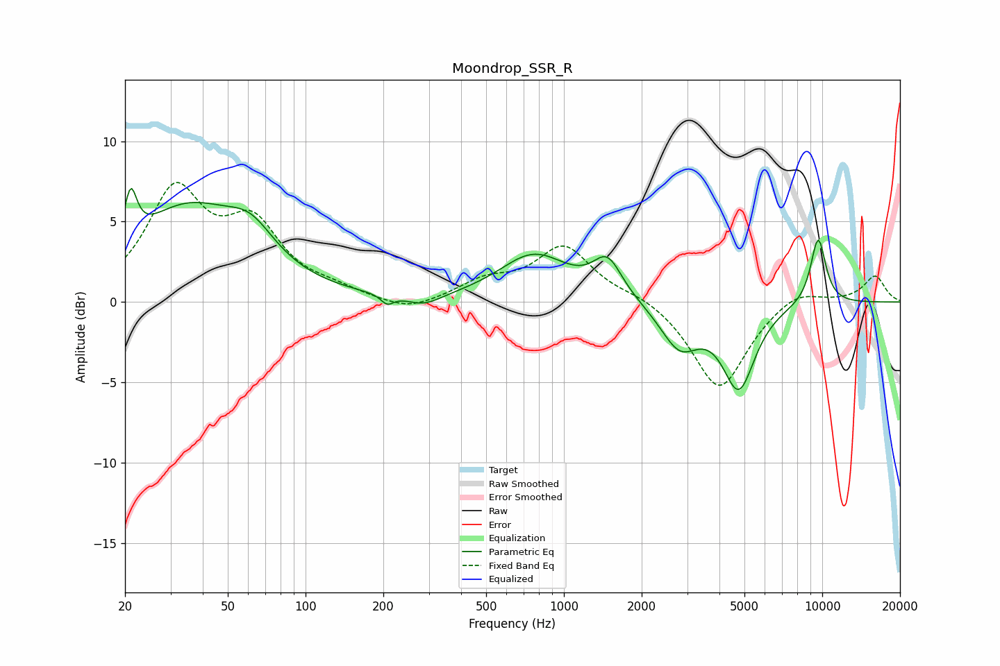

# Moondrop_SSR_R
See [usage instructions](https://github.com/jaakkopasanen/AutoEq#usage) for more options and info.

### Parametric EQs
Apply preamp of -7.2 dB when using parametric equalizer.

|   # | Type    |   Fc (Hz) |    Q |   Gain (dB) |
|-----|---------|-----------|------|-------------|
|   1 | Peaking |        21 | 6    |         3.1 |
|   2 | Peaking |        35 | 0.65 |         5.6 |
|   3 | Peaking |        61 | 1.52 |         2   |
|   4 | Peaking |       207 | 5.96 |        -0.6 |
|   5 | Peaking |       288 | 2.02 |        -0.7 |
|   6 | Peaking |       766 | 1.05 |         2.9 |
|   7 | Peaking |      1475 | 2.52 |         2.3 |
|   8 | Peaking |      2805 | 1.87 |        -2.7 |
|   9 | Peaking |      4754 | 2.23 |        -5.1 |
|  10 | Peaking |      9645 | 4.06 |         4.2 |

### Fixed Band EQs
When using fixed band (also called graphic) equalizer, apply preamp of **-7.5 dB** (if available) and set gains manually with these parameters.

|   # | Type    |   Fc (Hz) |    Q |   Gain (dB) |
|-----|---------|-----------|------|-------------|
|   1 | Peaking |        31 | 1.41 |         6.6 |
|   2 | Peaking |        62 | 1.41 |         4.3 |
|   3 | Peaking |       125 | 1.41 |         0.5 |
|   4 | Peaking |       250 | 1.41 |        -0.7 |
|   5 | Peaking |       500 | 1.41 |         1.1 |
|   6 | Peaking |      1000 | 1.41 |         3.4 |
|   7 | Peaking |      2000 | 1.41 |         0.5 |
|   8 | Peaking |      4000 | 1.41 |        -5.5 |
|   9 | Peaking |      8000 | 1.41 |         0.9 |
|  10 | Peaking |     16000 | 1.41 |         1.6 |

### Graphs

