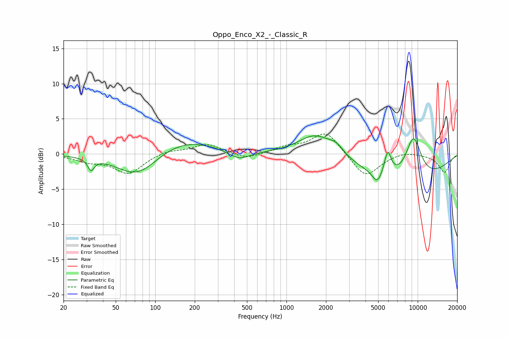

# Oppo_Enco_X2_-_Classic_R
See [usage instructions](https://github.com/jaakkopasanen/AutoEq#usage) for more options and info.

### Parametric EQs
Apply preamp of -2.7 dB when using parametric equalizer.

|   # | Type    |   Fc (Hz) |    Q |   Gain (dB) |
|-----|---------|-----------|------|-------------|
|   1 | Peaking |        32 | 6    |        -1.6 |
|   2 | Peaking |        74 | 0.88 |        -3.8 |
|   3 | Peaking |       156 | 0.56 |         2.4 |
|   4 | Peaking |       437 | 1.67 |        -1.3 |
|   5 | Peaking |      1658 | 1.09 |         3.1 |
|   6 | Peaking |      2392 | 2.41 |         1.2 |
|   7 | Peaking |      4924 | 3.81 |        -1.8 |
|   8 | Peaking |      5912 | 5.11 |         3.4 |
|   9 | Peaking |      8150 | 0.39 |        -4.3 |
|  10 | Peaking |      9285 | 2.02 |         6.2 |

### Fixed Band EQs
When using fixed band (also called graphic) equalizer, apply preamp of **-2.9 dB** (if available) and set gains manually with these parameters.

|   # | Type    |   Fc (Hz) |    Q |   Gain (dB) |
|-----|---------|-----------|------|-------------|
|   1 | Peaking |        31 | 1.41 |        -0.9 |
|   2 | Peaking |        62 | 1.41 |        -2.7 |
|   3 | Peaking |       125 | 1.41 |         0.6 |
|   4 | Peaking |       250 | 1.41 |         1.4 |
|   5 | Peaking |       500 | 1.41 |        -0.8 |
|   6 | Peaking |      1000 | 1.41 |         0.9 |
|   7 | Peaking |      2000 | 1.41 |         3.3 |
|   8 | Peaking |      4000 | 1.41 |        -3.4 |
|   9 | Peaking |      8000 | 1.41 |         0.5 |
|  10 | Peaking |     16000 | 1.41 |        -2.6 |

### Graphs

