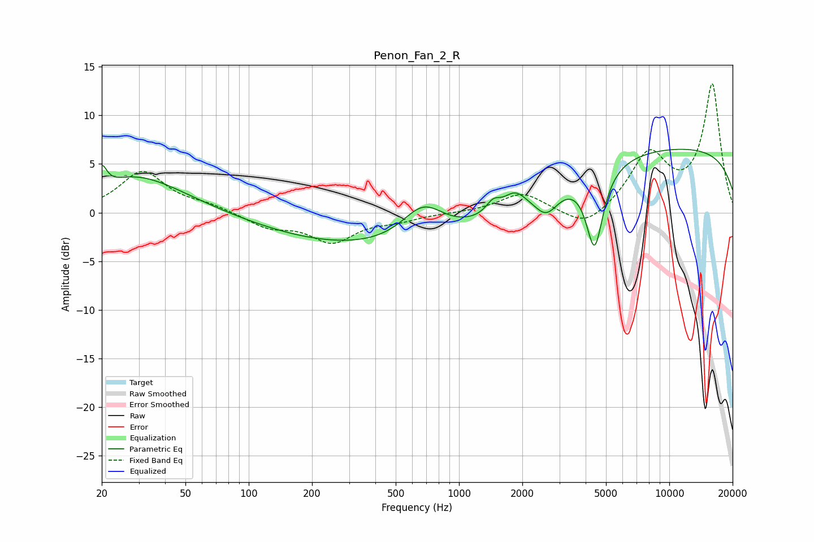

# Penon_Fan_2_R
See [usage instructions](https://github.com/jaakkopasanen/AutoEq#usage) for more options and info.

### Parametric EQs
Apply preamp of -6.6 dB when using parametric equalizer.

|   # | Type    |   Fc (Hz) |    Q |   Gain (dB) |
|-----|---------|-----------|------|-------------|
|   1 | Peaking |        20 | 1.65 |        -1   |
|   2 | Peaking |        20 | 5.97 |         2.2 |
|   3 | Peaking |        27 | 0.57 |         4.2 |
|   4 | Peaking |       497 | 0.23 |        -3.8 |
|   5 | Peaking |       676 | 1.41 |         3.6 |
|   6 | Peaking |      1453 | 4.26 |         1.2 |
|   7 | Peaking |      1840 | 2.69 |         1.7 |
|   8 | Peaking |      2605 | 2.45 |        -2.5 |
|   9 | Peaking |      4414 | 3.45 |        -8.2 |
|  10 | Peaking |     10000 | 0.18 |         6.7 |

### Fixed Band EQs
When using fixed band (also called graphic) equalizer, apply preamp of **-13.3 dB** (if available) and set gains manually with these parameters.

|   # | Type    |   Fc (Hz) |    Q |   Gain (dB) |
|-----|---------|-----------|------|-------------|
|   1 | Peaking |        31 | 1.41 |         4.2 |
|   2 | Peaking |        62 | 1.41 |         0.7 |
|   3 | Peaking |       125 | 1.41 |        -1.4 |
|   4 | Peaking |       250 | 1.41 |        -2.9 |
|   5 | Peaking |       500 | 1.41 |        -0.7 |
|   6 | Peaking |      1000 | 1.41 |        -0   |
|   7 | Peaking |      2000 | 1.41 |         2   |
|   8 | Peaking |      4000 | 1.41 |        -1.9 |
|   9 | Peaking |      8000 | 1.41 |         5.8 |
|  10 | Peaking |     16000 | 1.41 |        13   |

### Graphs

