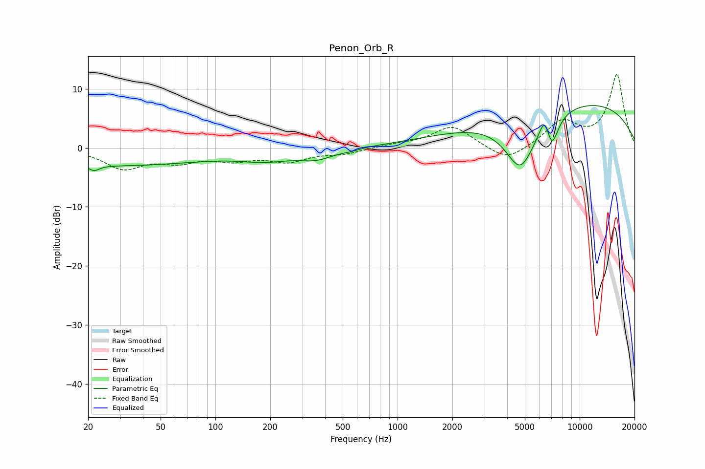

# Penon_Orb_R
See [usage instructions](https://github.com/jaakkopasanen/AutoEq#usage) for more options and info.

### Parametric EQs
Apply preamp of -7.3 dB when using parametric equalizer.

|   # | Type    |   Fc (Hz) |    Q |   Gain (dB) |
|-----|---------|-----------|------|-------------|
|   1 | Peaking |        22 | 4.95 |        -0.9 |
|   2 | Peaking |        27 | 0.26 |        -3   |
|   3 | Peaking |       188 | 1.01 |        -1.5 |
|   4 | Peaking |       358 | 1.44 |        -1.6 |
|   5 | Peaking |       553 | 3.31 |        -0.2 |
|   6 | Peaking |      4727 | 1.58 |        -9.5 |
|   7 | Peaking |      6448 | 4.63 |         4   |
|   8 | Peaking |      7004 | 3.87 |        -5.4 |
|   9 | Peaking |      7977 | 0.18 |         4   |
|  10 | Peaking |     10000 | 0.3  |         4   |

### Fixed Band EQs
When using fixed band (also called graphic) equalizer, apply preamp of **-12.5 dB** (if available) and set gains manually with these parameters.

|   # | Type    |   Fc (Hz) |    Q |   Gain (dB) |
|-----|---------|-----------|------|-------------|
|   1 | Peaking |        31 | 1.41 |        -3.3 |
|   2 | Peaking |        62 | 1.41 |        -2   |
|   3 | Peaking |       125 | 1.41 |        -1.7 |
|   4 | Peaking |       250 | 1.41 |        -2.1 |
|   5 | Peaking |       500 | 1.41 |        -0.9 |
|   6 | Peaking |      1000 | 1.41 |         0.5 |
|   7 | Peaking |      2000 | 1.41 |         3.7 |
|   8 | Peaking |      4000 | 1.41 |        -2.6 |
|   9 | Peaking |      8000 | 1.41 |         4.3 |
|  10 | Peaking |     16000 | 1.41 |        12.3 |

### Graphs

