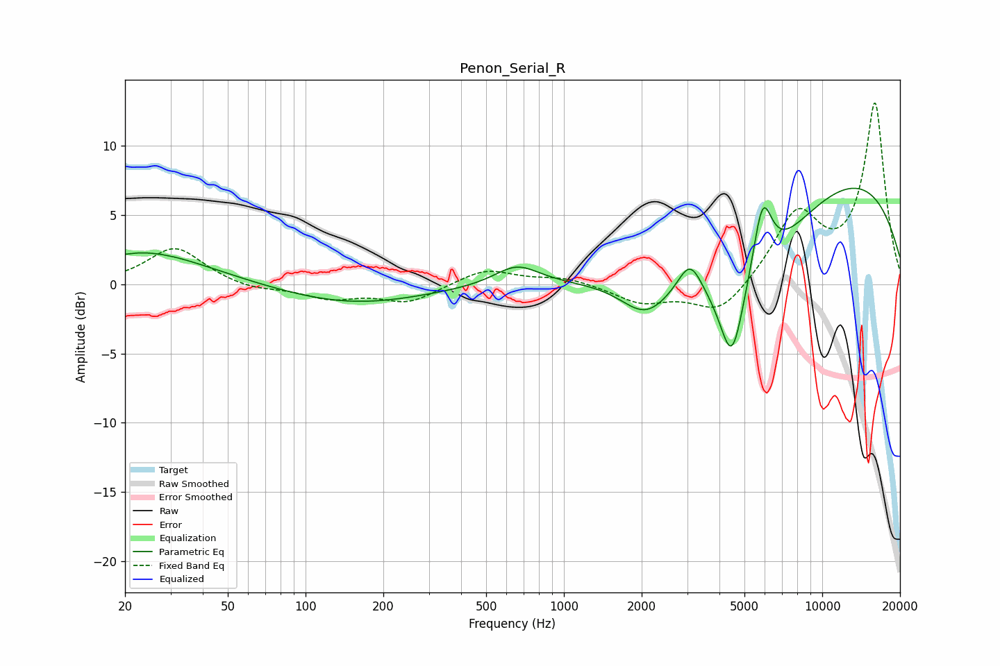

# Penon_Serial_R
See [usage instructions](https://github.com/jaakkopasanen/AutoEq#usage) for more options and info.

### Parametric EQs
Apply preamp of -7.0 dB when using parametric equalizer.

|   # | Type    |   Fc (Hz) |    Q |   Gain (dB) |
|-----|---------|-----------|------|-------------|
|   1 | Peaking |        20 | 4.87 |        -0.1 |
|   2 | Peaking |        23 | 0.56 |         2.4 |
|   3 | Peaking |       152 | 0.51 |        -1.4 |
|   4 | Peaking |       658 | 1.63 |         1.5 |
|   5 | Peaking |      2067 | 1.48 |        -2.5 |
|   6 | Peaking |      3078 | 3    |         2.5 |
|   7 | Peaking |      4467 | 3.13 |        -5.6 |
|   8 | Peaking |      5052 | 0.59 |        -6.6 |
|   9 | Peaking |      5873 | 3.66 |         5.3 |
|  10 | Peaking |     10000 | 0.25 |         8.9 |

### Fixed Band EQs
When using fixed band (also called graphic) equalizer, apply preamp of **-13.2 dB** (if available) and set gains manually with these parameters.

|   # | Type    |   Fc (Hz) |    Q |   Gain (dB) |
|-----|---------|-----------|------|-------------|
|   1 | Peaking |        31 | 1.41 |         2.7 |
|   2 | Peaking |        62 | 1.41 |        -0.4 |
|   3 | Peaking |       125 | 1.41 |        -1   |
|   4 | Peaking |       250 | 1.41 |        -1.3 |
|   5 | Peaking |       500 | 1.41 |         1.1 |
|   6 | Peaking |      1000 | 1.41 |         0.5 |
|   7 | Peaking |      2000 | 1.41 |        -1.3 |
|   8 | Peaking |      4000 | 1.41 |        -2.3 |
|   9 | Peaking |      8000 | 1.41 |         4.9 |
|  10 | Peaking |     16000 | 1.41 |        13   |

### Graphs

