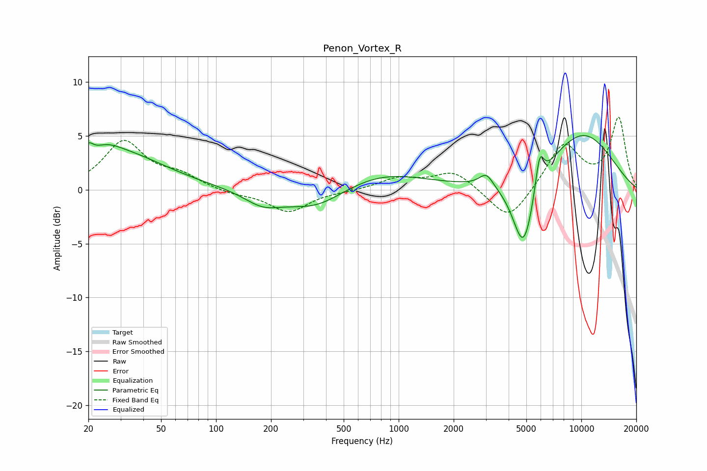

# Penon_Vortex_R
See [usage instructions](https://github.com/jaakkopasanen/AutoEq#usage) for more options and info.

### Parametric EQs
Apply preamp of -5.1 dB when using parametric equalizer.

|   # | Type    |   Fc (Hz) |    Q |   Gain (dB) |
|-----|---------|-----------|------|-------------|
|   1 | Peaking |        20 | 5.77 |         1   |
|   2 | Peaking |        25 | 1.91 |         0.8 |
|   3 | Peaking |        29 | 0.55 |         3.4 |
|   4 | Peaking |       180 | 1.36 |        -1.3 |
|   5 | Peaking |       350 | 0.85 |        -1.9 |
|   6 | Peaking |       799 | 0.59 |         1.7 |
|   7 | Peaking |      3021 | 3.71 |         1.2 |
|   8 | Peaking |      4830 | 2.29 |        -7.2 |
|   9 | Peaking |      5908 | 5.82 |         3.2 |
|  10 | Peaking |     10000 | 0.6  |         5.3 |

### Fixed Band EQs
When using fixed band (also called graphic) equalizer, apply preamp of **-6.8 dB** (if available) and set gains manually with these parameters.

|   # | Type    |   Fc (Hz) |    Q |   Gain (dB) |
|-----|---------|-----------|------|-------------|
|   1 | Peaking |        31 | 1.41 |         4.4 |
|   2 | Peaking |        62 | 1.41 |         1.2 |
|   3 | Peaking |       125 | 1.41 |        -0.4 |
|   4 | Peaking |       250 | 1.41 |        -2   |
|   5 | Peaking |       500 | 1.41 |        -0.1 |
|   6 | Peaking |      1000 | 1.41 |         1   |
|   7 | Peaking |      2000 | 1.41 |         1.7 |
|   8 | Peaking |      4000 | 1.41 |        -3.1 |
|   9 | Peaking |      8000 | 1.41 |         4.3 |
|  10 | Peaking |     16000 | 1.41 |         6.6 |

### Graphs

