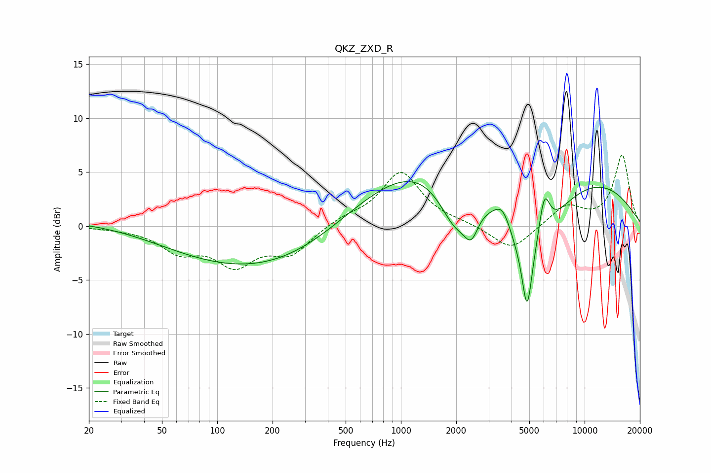

# QKZ_ZXD_R
See [usage instructions](https://github.com/jaakkopasanen/AutoEq#usage) for more options and info.

### Parametric EQs
Apply preamp of -4.2 dB when using parametric equalizer.

|   # | Type    |   Fc (Hz) |    Q |   Gain (dB) |
|-----|---------|-----------|------|-------------|
|   1 | Peaking |        30 | 0.18 |         0.8 |
|   2 | Peaking |       153 | 0.3  |        -4.5 |
|   3 | Peaking |      1615 | 0.32 |         6.7 |
|   4 | Peaking |      1985 | 1.46 |        -5.1 |
|   5 | Peaking |      2417 | 3.67 |        -2.4 |
|   6 | Peaking |      3588 | 3.11 |         1.9 |
|   7 | Peaking |      4863 | 5.52 |        -5.6 |
|   8 | Peaking |      4928 | 0.84 |       -10.4 |
|   9 | Peaking |      6026 | 4.38 |         4.3 |
|  10 | Peaking |      8115 | 0.31 |         5.4 |

### Fixed Band EQs
When using fixed band (also called graphic) equalizer, apply preamp of **-6.7 dB** (if available) and set gains manually with these parameters.

|   # | Type    |   Fc (Hz) |    Q |   Gain (dB) |
|-----|---------|-----------|------|-------------|
|   1 | Peaking |        31 | 1.41 |        -0.1 |
|   2 | Peaking |        62 | 1.41 |        -2.1 |
|   3 | Peaking |       125 | 1.41 |        -3.3 |
|   4 | Peaking |       250 | 1.41 |        -2.4 |
|   5 | Peaking |       500 | 1.41 |         0.7 |
|   6 | Peaking |      1000 | 1.41 |         5   |
|   7 | Peaking |      2000 | 1.41 |         0.2 |
|   8 | Peaking |      4000 | 1.41 |        -2.3 |
|   9 | Peaking |      8000 | 1.41 |         1.9 |
|  10 | Peaking |     16000 | 1.41 |         6.5 |

### Graphs

