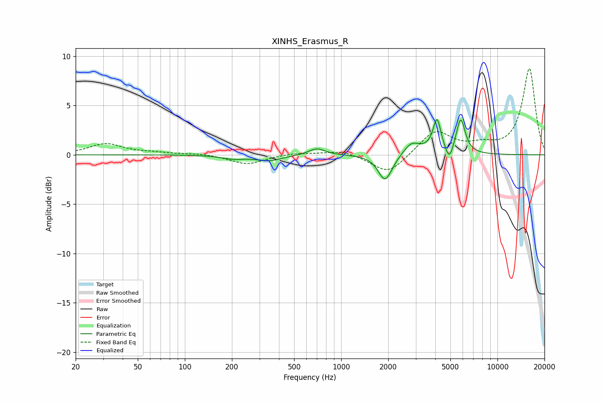

# XINHS_Erasmus_R
See [usage instructions](https://github.com/jaakkopasanen/AutoEq#usage) for more options and info.

### Parametric EQs
Apply preamp of -3.7 dB when using parametric equalizer.

|   # | Type    |   Fc (Hz) |    Q |   Gain (dB) |
|-----|---------|-----------|------|-------------|
|   1 | Peaking |       204 | 1.91 |        -0.4 |
|   2 | Peaking |       346 | 1.75 |        -0.6 |
|   3 | Peaking |       700 | 2.69 |         0.7 |
|   4 | Peaking |      1899 | 3.32 |        -2.3 |
|   5 | Peaking |      2012 | 2.8  |        -0.4 |
|   6 | Peaking |      2818 | 2.82 |         1.2 |
|   7 | Peaking |      3729 | 2.2  |         0.3 |
|   8 | Peaking |      4107 | 5.86 |         3.2 |
|   9 | Peaking |      4924 | 6    |        -1.5 |
|  10 | Peaking |      5819 | 4.89 |         3.6 |

### Fixed Band EQs
When using fixed band (also called graphic) equalizer, apply preamp of **-8.8 dB** (if available) and set gains manually with these parameters.

|   # | Type    |   Fc (Hz) |    Q |   Gain (dB) |
|-----|---------|-----------|------|-------------|
|   1 | Peaking |        31 | 1.41 |         1.1 |
|   2 | Peaking |        62 | 1.41 |         0.2 |
|   3 | Peaking |       125 | 1.41 |         0.1 |
|   4 | Peaking |       250 | 1.41 |        -1   |
|   5 | Peaking |       500 | 1.41 |         0.2 |
|   6 | Peaking |      1000 | 1.41 |         0.5 |
|   7 | Peaking |      2000 | 1.41 |        -2   |
|   8 | Peaking |      4000 | 1.41 |         2.4 |
|   9 | Peaking |      8000 | 1.41 |         0.7 |
|  10 | Peaking |     16000 | 1.41 |         8.7 |

### Graphs

