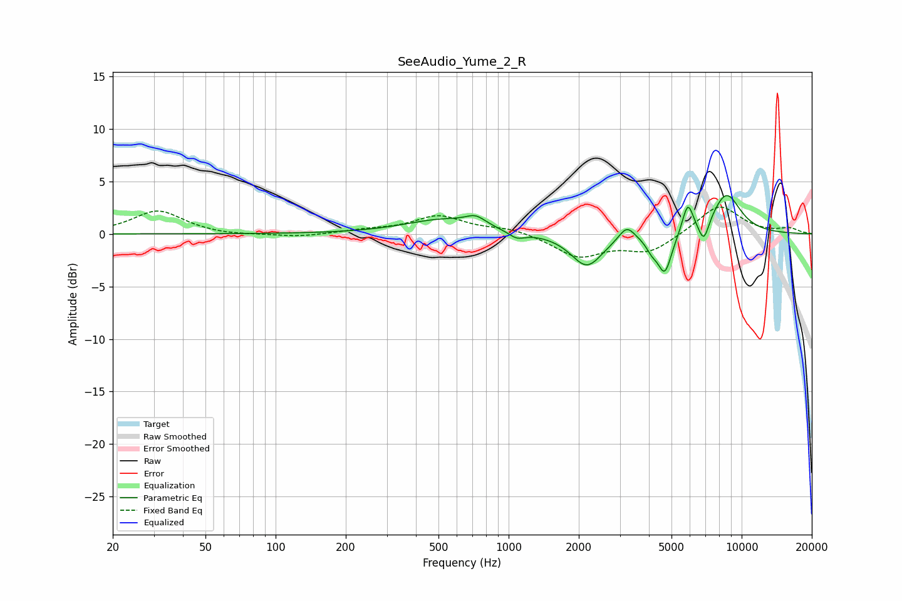

# SeeAudio_Yume_2_R
See [usage instructions](https://github.com/jaakkopasanen/AutoEq#usage) for more options and info.

### Parametric EQs
Apply preamp of -3.7 dB when using parametric equalizer.

|   # | Type    |   Fc (Hz) |    Q |   Gain (dB) |
|-----|---------|-----------|------|-------------|
|   1 | Peaking |       524 | 0.86 |         1.3 |
|   2 | Peaking |       722 | 3.32 |         0.8 |
|   3 | Peaking |      1082 | 3.91 |        -0.7 |
|   4 | Peaking |      2166 | 2.07 |        -3.1 |
|   5 | Peaking |      3211 | 4.2  |         1.4 |
|   6 | Peaking |      4116 | 5.43 |        -1   |
|   7 | Peaking |      4681 | 4.59 |        -3.7 |
|   8 | Peaking |      5874 | 5.96 |         2.8 |
|   9 | Peaking |      6881 | 6    |        -2.1 |
|  10 | Peaking |      8594 | 2.07 |         3.8 |

### Fixed Band EQs
When using fixed band (also called graphic) equalizer, apply preamp of **-2.6 dB** (if available) and set gains manually with these parameters.

|   # | Type    |   Fc (Hz) |    Q |   Gain (dB) |
|-----|---------|-----------|------|-------------|
|   1 | Peaking |        31 | 1.41 |         2.2 |
|   2 | Peaking |        62 | 1.41 |        -0.2 |
|   3 | Peaking |       125 | 1.41 |        -0.3 |
|   4 | Peaking |       250 | 1.41 |         0.3 |
|   5 | Peaking |       500 | 1.41 |         1.7 |
|   6 | Peaking |      1000 | 1.41 |         0.5 |
|   7 | Peaking |      2000 | 1.41 |        -2.1 |
|   8 | Peaking |      4000 | 1.41 |        -1.7 |
|   9 | Peaking |      8000 | 1.41 |         2.8 |
|  10 | Peaking |     16000 | 1.41 |         0.5 |

### Graphs

