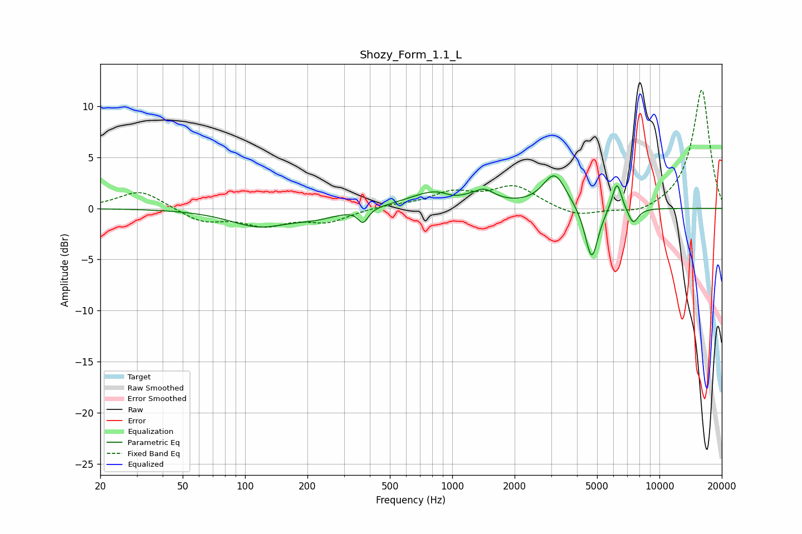

# Shozy_Form_1.1_L
See [usage instructions](https://github.com/jaakkopasanen/AutoEq#usage) for more options and info.

### Parametric EQs
Apply preamp of -3.3 dB when using parametric equalizer.

|   # | Type    |   Fc (Hz) |    Q |   Gain (dB) |
|-----|---------|-----------|------|-------------|
|   1 | Peaking |       116 | 1    |        -1.7 |
|   2 | Peaking |       219 | 1.29 |        -0.7 |
|   3 | Peaking |       371 | 6    |        -1.3 |
|   4 | Peaking |       888 | 1.05 |         2   |
|   5 | Peaking |      1012 | 2.48 |        -0.7 |
|   6 | Peaking |      1431 | 2.96 |         1   |
|   7 | Peaking |      3118 | 2.52 |         3.3 |
|   8 | Peaking |      4710 | 4.36 |        -5.3 |
|   9 | Peaking |      6234 | 5.96 |         2.9 |
|  10 | Peaking |      7458 | 5.19 |        -1.6 |

### Fixed Band EQs
When using fixed band (also called graphic) equalizer, apply preamp of **-11.7 dB** (if available) and set gains manually with these parameters.

|   # | Type    |   Fc (Hz) |    Q |   Gain (dB) |
|-----|---------|-----------|------|-------------|
|   1 | Peaking |        31 | 1.41 |         1.8 |
|   2 | Peaking |        62 | 1.41 |        -1.3 |
|   3 | Peaking |       125 | 1.41 |        -1.5 |
|   4 | Peaking |       250 | 1.41 |        -1.2 |
|   5 | Peaking |       500 | 1.41 |         0.3 |
|   6 | Peaking |      1000 | 1.41 |         1.4 |
|   7 | Peaking |      2000 | 1.41 |         2.1 |
|   8 | Peaking |      4000 | 1.41 |        -0.9 |
|   9 | Peaking |      8000 | 1.41 |        -0.7 |
|  10 | Peaking |     16000 | 1.41 |        11.7 |

### Graphs

