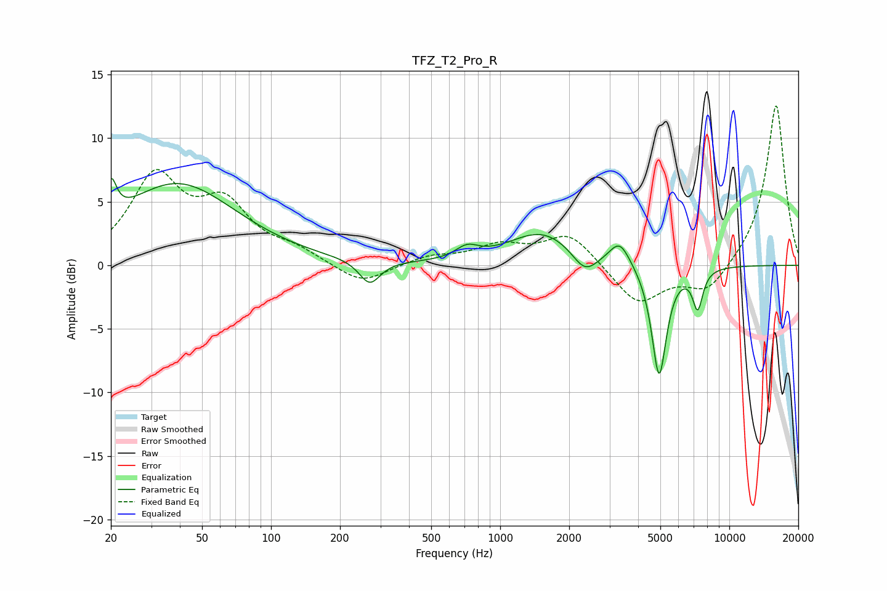

# TFZ_T2_Pro_R
See [usage instructions](https://github.com/jaakkopasanen/AutoEq#usage) for more options and info.

### Parametric EQs
Apply preamp of -6.9 dB when using parametric equalizer.

|   # | Type    |   Fc (Hz) |    Q |   Gain (dB) |
|-----|---------|-----------|------|-------------|
|   1 | Peaking |        20 | 5.96 |         2.9 |
|   2 | Peaking |        39 | 0.55 |         6.4 |
|   3 | Peaking |       270 | 3.11 |        -1.9 |
|   4 | Peaking |       717 | 2.93 |         0.9 |
|   5 | Peaking |      1529 | 0.96 |         2.6 |
|   6 | Peaking |      2340 | 2.54 |        -1.7 |
|   7 | Peaking |      3323 | 3.32 |         1.4 |
|   8 | Peaking |      3323 | 2.66 |         0.5 |
|   9 | Peaking |      4937 | 4.3  |        -8.9 |
|  10 | Peaking |      7278 | 6    |        -3.1 |

### Fixed Band EQs
When using fixed band (also called graphic) equalizer, apply preamp of **-12.6 dB** (if available) and set gains manually with these parameters.

|   # | Type    |   Fc (Hz) |    Q |   Gain (dB) |
|-----|---------|-----------|------|-------------|
|   1 | Peaking |        31 | 1.41 |         6.7 |
|   2 | Peaking |        62 | 1.41 |         4.3 |
|   3 | Peaking |       125 | 1.41 |         1   |
|   4 | Peaking |       250 | 1.41 |        -1.6 |
|   5 | Peaking |       500 | 1.41 |         0.7 |
|   6 | Peaking |      1000 | 1.41 |         1.4 |
|   7 | Peaking |      2000 | 1.41 |         2.5 |
|   8 | Peaking |      4000 | 1.41 |        -3.1 |
|   9 | Peaking |      8000 | 1.41 |        -2.2 |
|  10 | Peaking |     16000 | 1.41 |        12.8 |

### Graphs

