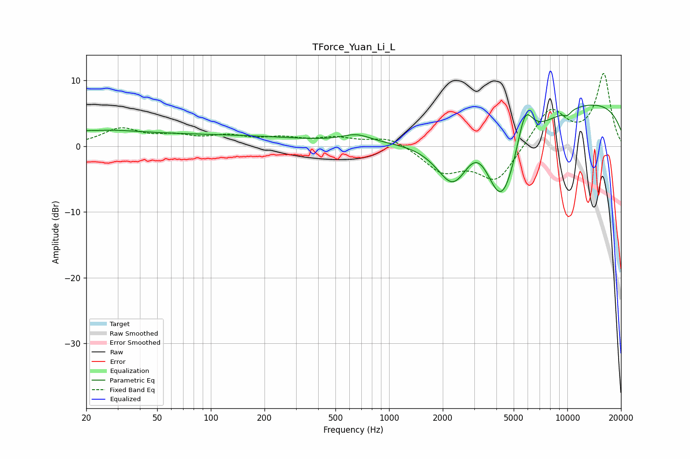

# TForce_Yuan_Li_L
See [usage instructions](https://github.com/jaakkopasanen/AutoEq#usage) for more options and info.

### Parametric EQs
Apply preamp of -6.4 dB when using parametric equalizer.

|   # | Type    |   Fc (Hz) |    Q |   Gain (dB) |
|-----|---------|-----------|------|-------------|
|   1 | Peaking |        20 | 4.94 |         0.2 |
|   2 | Peaking |        24 | 0.74 |         1   |
|   3 | Peaking |        69 | 0.18 |         1.7 |
|   4 | Peaking |       657 | 1.7  |         1.2 |
|   5 | Peaking |      2286 | 1.52 |        -7   |
|   6 | Peaking |      3141 | 1.63 |         4.6 |
|   7 | Peaking |      4269 | 1.16 |       -15.1 |
|   8 | Peaking |      5780 | 3    |         6.5 |
|   9 | Peaking |      9861 | 0.18 |         7.4 |
|  10 | Peaking |     10000 | 5.63 |        -0.7 |

### Fixed Band EQs
When using fixed band (also called graphic) equalizer, apply preamp of **-11.2 dB** (if available) and set gains manually with these parameters.

|   # | Type    |   Fc (Hz) |    Q |   Gain (dB) |
|-----|---------|-----------|------|-------------|
|   1 | Peaking |        31 | 1.41 |         2.5 |
|   2 | Peaking |        62 | 1.41 |         1.2 |
|   3 | Peaking |       125 | 1.41 |         1.3 |
|   4 | Peaking |       250 | 1.41 |         1   |
|   5 | Peaking |       500 | 1.41 |         1.1 |
|   6 | Peaking |      1000 | 1.41 |         1.5 |
|   7 | Peaking |      2000 | 1.41 |        -3.7 |
|   8 | Peaking |      4000 | 1.41 |        -5.4 |
|   9 | Peaking |      8000 | 1.41 |         5.8 |
|  10 | Peaking |     16000 | 1.41 |        10.9 |

### Graphs

