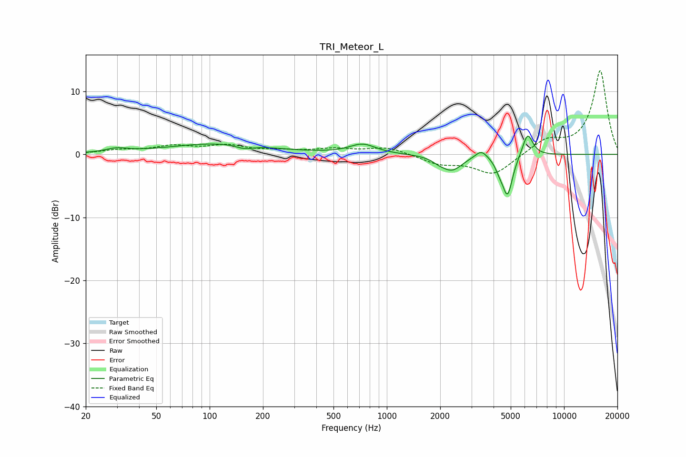

# TRI_Meteor_L
See [usage instructions](https://github.com/jaakkopasanen/AutoEq#usage) for more options and info.

### Parametric EQs
Apply preamp of -3.0 dB when using parametric equalizer.

|   # | Type    |   Fc (Hz) |    Q |   Gain (dB) |
|-----|---------|-----------|------|-------------|
|   1 | Peaking |        30 | 2.27 |         0.6 |
|   2 | Peaking |       113 | 0.5  |         1.7 |
|   3 | Peaking |       158 | 2.87 |        -0.6 |
|   4 | Peaking |       730 | 1.93 |         1.5 |
|   5 | Peaking |      1969 | 3.85 |        -0.5 |
|   6 | Peaking |      2330 | 2.41 |        -2.4 |
|   7 | Peaking |      3412 | 4.15 |         1.3 |
|   8 | Peaking |      4308 | 6    |        -1.1 |
|   9 | Peaking |      4796 | 4.82 |        -6.4 |
|  10 | Peaking |      6231 | 4.73 |         3.7 |

### Fixed Band EQs
When using fixed band (also called graphic) equalizer, apply preamp of **-13.4 dB** (if available) and set gains manually with these parameters.

|   # | Type    |   Fc (Hz) |    Q |   Gain (dB) |
|-----|---------|-----------|------|-------------|
|   1 | Peaking |        31 | 1.41 |         0.6 |
|   2 | Peaking |        62 | 1.41 |         1.2 |
|   3 | Peaking |       125 | 1.41 |         1.3 |
|   4 | Peaking |       250 | 1.41 |         0.4 |
|   5 | Peaking |       500 | 1.41 |         0.8 |
|   6 | Peaking |      1000 | 1.41 |         1.1 |
|   7 | Peaking |      2000 | 1.41 |        -1.4 |
|   8 | Peaking |      4000 | 1.41 |        -3.2 |
|   9 | Peaking |      8000 | 1.41 |         2.2 |
|  10 | Peaking |     16000 | 1.41 |        13.3 |

### Graphs

