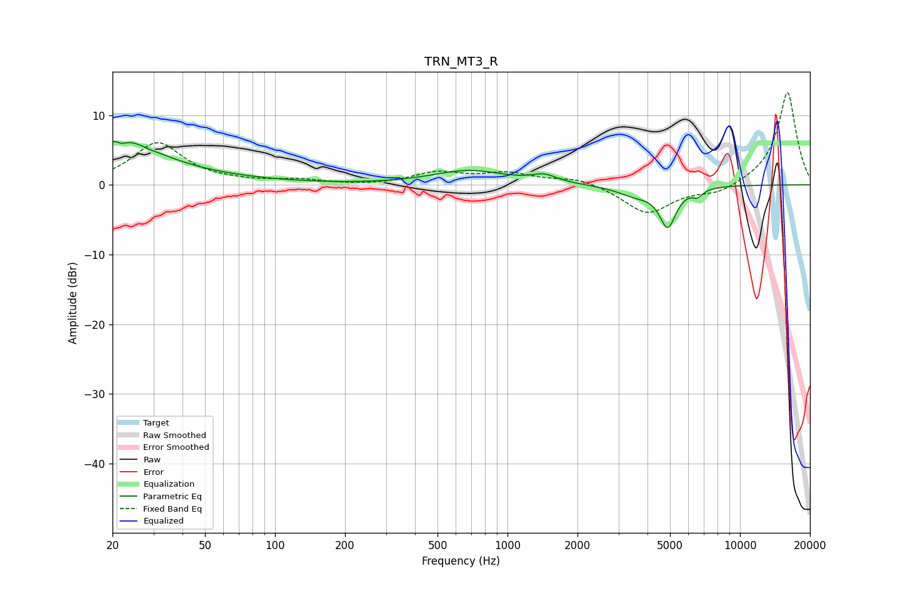

# TRN_MT3_R
See [usage instructions](https://github.com/jaakkopasanen/AutoEq#usage) for more options and info.

### Parametric EQs
Apply preamp of -6.3 dB when using parametric equalizer.

|   # | Type    |   Fc (Hz) |    Q |   Gain (dB) |
|-----|---------|-----------|------|-------------|
|   1 | Peaking |        21 | 5.81 |         3.3 |
|   2 | Peaking |        21 | 5.95 |        -3.7 |
|   3 | Peaking |        22 | 0.9  |         5.6 |
|   4 | Peaking |        29 | 4.64 |        -0.2 |
|   5 | Peaking |        36 | 0.42 |         1   |
|   6 | Peaking |       683 | 0.91 |         2   |
|   7 | Peaking |      1440 | 2.71 |         1.1 |
|   8 | Peaking |      3554 | 1.73 |        -1.4 |
|   9 | Peaking |      4888 | 3.91 |        -5.6 |
|  10 | Peaking |      6575 | 6    |        -1   |

### Fixed Band EQs
When using fixed band (also called graphic) equalizer, apply preamp of **-13.3 dB** (if available) and set gains manually with these parameters.

|   # | Type    |   Fc (Hz) |    Q |   Gain (dB) |
|-----|---------|-----------|------|-------------|
|   1 | Peaking |        31 | 1.41 |         6   |
|   2 | Peaking |        62 | 1.41 |         0.3 |
|   3 | Peaking |       125 | 1.41 |         0.6 |
|   4 | Peaking |       250 | 1.41 |        -0.2 |
|   5 | Peaking |       500 | 1.41 |         1.7 |
|   6 | Peaking |      1000 | 1.41 |         1.5 |
|   7 | Peaking |      2000 | 1.41 |         1   |
|   8 | Peaking |      4000 | 1.41 |        -4.2 |
|   9 | Peaking |      8000 | 1.41 |        -1.3 |
|  10 | Peaking |     16000 | 1.41 |        13.4 |

### Graphs

