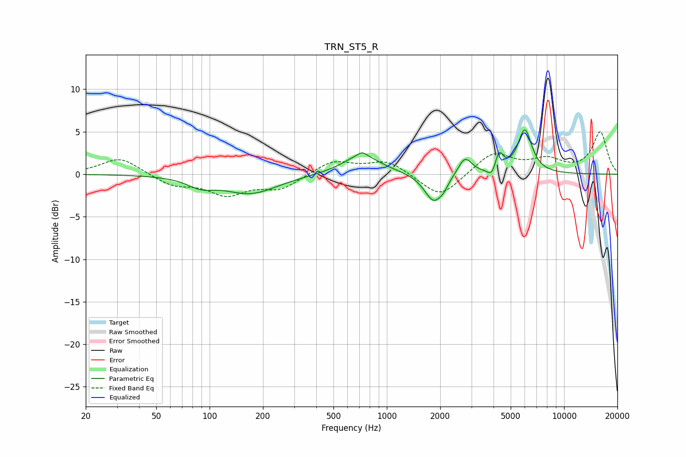

# TRN_ST5_R
See [usage instructions](https://github.com/jaakkopasanen/AutoEq#usage) for more options and info.

### Parametric EQs
Apply preamp of -5.3 dB when using parametric equalizer.

|   # | Type    |   Fc (Hz) |    Q |   Gain (dB) |
|-----|---------|-----------|------|-------------|
|   1 | Peaking |        89 | 1.91 |        -1   |
|   2 | Peaking |       170 | 0.92 |        -2.2 |
|   3 | Peaking |       720 | 1.32 |         2.3 |
|   4 | Peaking |       725 | 6    |         0.5 |
|   5 | Peaking |      1841 | 2.68 |        -3.4 |
|   6 | Peaking |      2096 | 5.7  |        -0.6 |
|   7 | Peaking |      2758 | 3.67 |         2.1 |
|   8 | Peaking |      3914 | 5.98 |        -1.1 |
|   9 | Peaking |      4301 | 6    |         2.2 |
|  10 | Peaking |      6004 | 3.48 |         5.1 |

### Fixed Band EQs
When using fixed band (also called graphic) equalizer, apply preamp of **-5.1 dB** (if available) and set gains manually with these parameters.

|   # | Type    |   Fc (Hz) |    Q |   Gain (dB) |
|-----|---------|-----------|------|-------------|
|   1 | Peaking |        31 | 1.41 |         2   |
|   2 | Peaking |        62 | 1.41 |        -1.3 |
|   3 | Peaking |       125 | 1.41 |        -2.2 |
|   4 | Peaking |       250 | 1.41 |        -1.7 |
|   5 | Peaking |       500 | 1.41 |         1.6 |
|   6 | Peaking |      1000 | 1.41 |         1.6 |
|   7 | Peaking |      2000 | 1.41 |        -2.9 |
|   8 | Peaking |      4000 | 1.41 |         2.5 |
|   9 | Peaking |      8000 | 1.41 |         1.5 |
|  10 | Peaking |     16000 | 1.41 |         4.9 |

### Graphs

