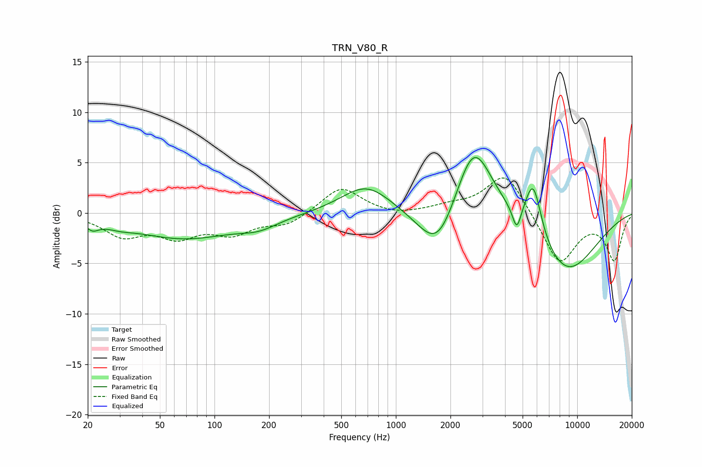

# TRN_V80_R
See [usage instructions](https://github.com/jaakkopasanen/AutoEq#usage) for more options and info.

### Parametric EQs
Apply preamp of -5.6 dB when using parametric equalizer.

|   # | Type    |   Fc (Hz) |    Q |   Gain (dB) |
|-----|---------|-----------|------|-------------|
|   1 | Peaking |        21 | 4.07 |        -0.8 |
|   2 | Peaking |        30 | 1.89 |        -0.4 |
|   3 | Peaking |        68 | 0.51 |        -2.5 |
|   4 | Peaking |       176 | 1.33 |        -0.9 |
|   5 | Peaking |       687 | 1.03 |         2.8 |
|   6 | Peaking |      1711 | 1.3  |        -5.2 |
|   7 | Peaking |      2679 | 1.31 |         8.2 |
|   8 | Peaking |      4641 | 6    |        -2.3 |
|   9 | Peaking |      5723 | 3.02 |         5.5 |
|  10 | Peaking |      8596 | 0.71 |        -6.1 |

### Fixed Band EQs
When using fixed band (also called graphic) equalizer, apply preamp of **-3.6 dB** (if available) and set gains manually with these parameters.

|   # | Type    |   Fc (Hz) |    Q |   Gain (dB) |
|-----|---------|-----------|------|-------------|
|   1 | Peaking |        31 | 1.41 |        -2.1 |
|   2 | Peaking |        62 | 1.41 |        -2.1 |
|   3 | Peaking |       125 | 1.41 |        -1.8 |
|   4 | Peaking |       250 | 1.41 |        -1.1 |
|   5 | Peaking |       500 | 1.41 |         2.6 |
|   6 | Peaking |      1000 | 1.41 |        -0.3 |
|   7 | Peaking |      2000 | 1.41 |         0.6 |
|   8 | Peaking |      4000 | 1.41 |         4.1 |
|   9 | Peaking |      8000 | 1.41 |        -5.1 |
|  10 | Peaking |     16000 | 1.41 |        -4.5 |

### Graphs

