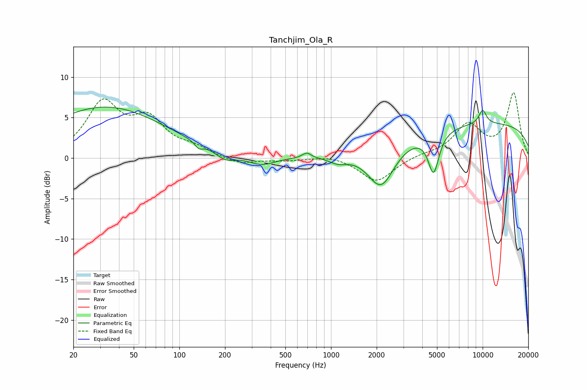

# Tanchjim_Ola_R
See [usage instructions](https://github.com/jaakkopasanen/AutoEq#usage) for more options and info.

### Parametric EQs
Apply preamp of -6.4 dB when using parametric equalizer.

|   # | Type    |   Fc (Hz) |    Q |   Gain (dB) |
|-----|---------|-----------|------|-------------|
|   1 | Peaking |        32 | 0.36 |         6.3 |
|   2 | Peaking |       134 | 5.57 |        -0.7 |
|   3 | Peaking |       201 | 2.16 |        -1.1 |
|   4 | Peaking |       348 | 1.59 |        -1.1 |
|   5 | Peaking |       692 | 4.93 |         0.7 |
|   6 | Peaking |      1114 | 2.35 |        -0.8 |
|   7 | Peaking |      2141 | 1.59 |        -5.3 |
|   8 | Peaking |      4746 | 3.93 |        -5   |
|   9 | Peaking |     10000 | 0.18 |         4.3 |
|  10 | Peaking |     10000 | 4.84 |         1.7 |

### Fixed Band EQs
When using fixed band (also called graphic) equalizer, apply preamp of **-8.2 dB** (if available) and set gains manually with these parameters.

|   # | Type    |   Fc (Hz) |    Q |   Gain (dB) |
|-----|---------|-----------|------|-------------|
|   1 | Peaking |        31 | 1.41 |         6.5 |
|   2 | Peaking |        62 | 1.41 |         4.2 |
|   3 | Peaking |       125 | 1.41 |         1   |
|   4 | Peaking |       250 | 1.41 |        -0.8 |
|   5 | Peaking |       500 | 1.41 |        -0.3 |
|   6 | Peaking |      1000 | 1.41 |         0.4 |
|   7 | Peaking |      2000 | 1.41 |        -3   |
|   8 | Peaking |      4000 | 1.41 |         0.3 |
|   9 | Peaking |      8000 | 1.41 |         4   |
|  10 | Peaking |     16000 | 1.41 |         7.9 |

### Graphs

