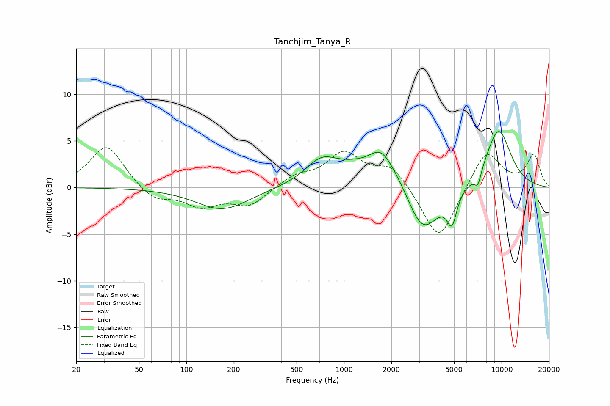

# Tanchjim_Tanya_R
See [usage instructions](https://github.com/jaakkopasanen/AutoEq#usage) for more options and info.

### Parametric EQs
Apply preamp of -6.1 dB when using parametric equalizer.

|   # | Type    |   Fc (Hz) |    Q |   Gain (dB) |
|-----|---------|-----------|------|-------------|
|   1 | Peaking |       169 | 0.85 |        -2.4 |
|   2 | Peaking |       719 | 1.38 |         2.4 |
|   3 | Peaking |      1371 | 1.95 |        -0.6 |
|   4 | Peaking |      1614 | 0.83 |         3.9 |
|   5 | Peaking |      1736 | 2.12 |         1.4 |
|   6 | Peaking |      2381 | 1.93 |         0.4 |
|   7 | Peaking |      3130 | 1.27 |        -5.9 |
|   8 | Peaking |      4840 | 4.57 |        -3.1 |
|   9 | Peaking |      7073 | 6    |        -1.6 |
|  10 | Peaking |      9556 | 1.5  |         6.3 |

### Fixed Band EQs
When using fixed band (also called graphic) equalizer, apply preamp of **-4.4 dB** (if available) and set gains manually with these parameters.

|   # | Type    |   Fc (Hz) |    Q |   Gain (dB) |
|-----|---------|-----------|------|-------------|
|   1 | Peaking |        31 | 1.41 |         4.6 |
|   2 | Peaking |        62 | 1.41 |        -1.5 |
|   3 | Peaking |       125 | 1.41 |        -1.9 |
|   4 | Peaking |       250 | 1.41 |        -1.9 |
|   5 | Peaking |       500 | 1.41 |         1.2 |
|   6 | Peaking |      1000 | 1.41 |         3.5 |
|   7 | Peaking |      2000 | 1.41 |         2.3 |
|   8 | Peaking |      4000 | 1.41 |        -6   |
|   9 | Peaking |      8000 | 1.41 |         4.1 |
|  10 | Peaking |     16000 | 1.41 |         3.4 |

### Graphs

