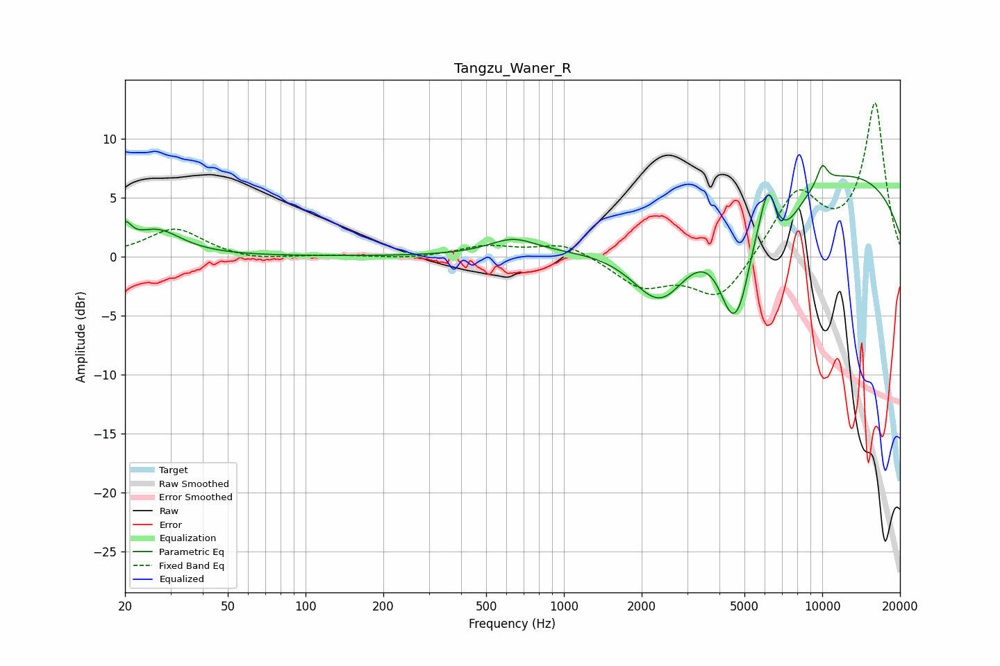

# Tangzu_Waner_R
See [usage instructions](https://github.com/jaakkopasanen/AutoEq#usage) for more options and info.

### Parametric EQs
Apply preamp of -7.8 dB when using parametric equalizer.

|   # | Type    |   Fc (Hz) |    Q |   Gain (dB) |
|-----|---------|-----------|------|-------------|
|   1 | Peaking |        20 | 5.91 |         1.7 |
|   2 | Peaking |        27 | 1.51 |         2.2 |
|   3 | Peaking |       635 | 1.52 |         1.3 |
|   4 | Peaking |      2374 | 1.19 |        -6.6 |
|   5 | Peaking |      4487 | 2.44 |        -7.6 |
|   6 | Peaking |      4887 | 4.09 |        -1.8 |
|   7 | Peaking |      6165 | 4.27 |         4.5 |
|   8 | Peaking |      6988 | 1.65 |        -4.1 |
|   9 | Peaking |      9571 | 0.22 |         7.6 |
|  10 | Peaking |     10000 | 6    |         1.7 |

### Fixed Band EQs
When using fixed band (also called graphic) equalizer, apply preamp of **-13.1 dB** (if available) and set gains manually with these parameters.

|   # | Type    |   Fc (Hz) |    Q |   Gain (dB) |
|-----|---------|-----------|------|-------------|
|   1 | Peaking |        31 | 1.41 |         2.4 |
|   2 | Peaking |        62 | 1.41 |        -0.4 |
|   3 | Peaking |       125 | 1.41 |         0.1 |
|   4 | Peaking |       250 | 1.41 |        -0.2 |
|   5 | Peaking |       500 | 1.41 |         0.8 |
|   6 | Peaking |      1000 | 1.41 |         1.2 |
|   7 | Peaking |      2000 | 1.41 |        -2.5 |
|   8 | Peaking |      4000 | 1.41 |        -3.7 |
|   9 | Peaking |      8000 | 1.41 |         5.3 |
|  10 | Peaking |     16000 | 1.41 |        12.9 |

### Graphs

