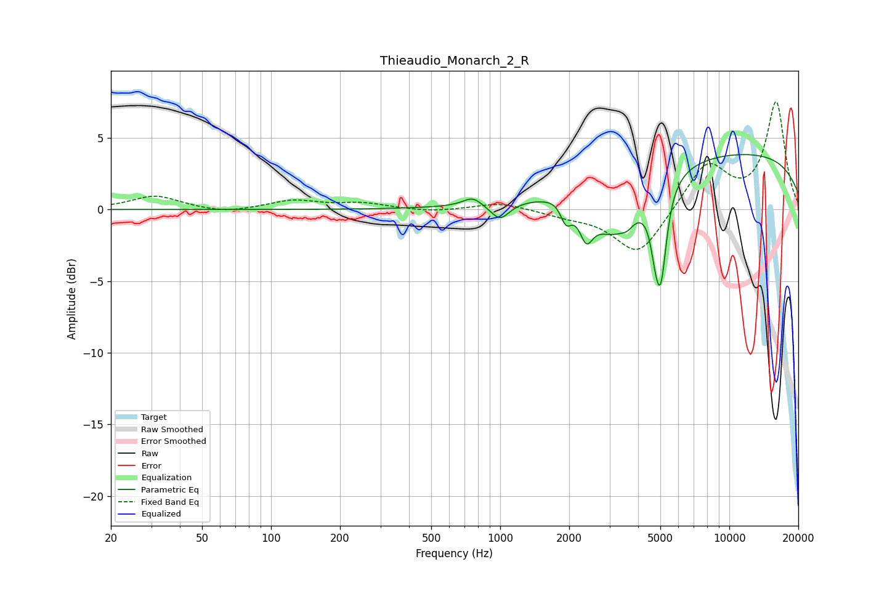

# Thieaudio_Monarch_2_R
See [usage instructions](https://github.com/jaakkopasanen/AutoEq#usage) for more options and info.

### Parametric EQs
Apply preamp of -3.9 dB when using parametric equalizer.

|   # | Type    |   Fc (Hz) |    Q |   Gain (dB) |
|-----|---------|-----------|------|-------------|
|   1 | Peaking |       757 | 3.5  |         0.6 |
|   2 | Peaking |       998 | 3.38 |        -1.2 |
|   3 | Peaking |      1901 | 3.07 |         0.9 |
|   4 | Peaking |      1935 | 5.23 |        -2   |
|   5 | Peaking |      2375 | 4.96 |        -2   |
|   6 | Peaking |      3173 | 1.2  |        -4.3 |
|   7 | Peaking |      3580 | 5.98 |        -0.3 |
|   8 | Peaking |      4759 | 5.81 |        -2.2 |
|   9 | Peaking |      5029 | 5.54 |        -5.7 |
|  10 | Peaking |      9117 | 0.18 |         4.1 |

### Fixed Band EQs
When using fixed band (also called graphic) equalizer, apply preamp of **-7.6 dB** (if available) and set gains manually with these parameters.

|   # | Type    |   Fc (Hz) |    Q |   Gain (dB) |
|-----|---------|-----------|------|-------------|
|   1 | Peaking |        31 | 1.41 |         1   |
|   2 | Peaking |        62 | 1.41 |        -0.3 |
|   3 | Peaking |       125 | 1.41 |         0.6 |
|   4 | Peaking |       250 | 1.41 |         0.4 |
|   5 | Peaking |       500 | 1.41 |        -0.2 |
|   6 | Peaking |      1000 | 1.41 |         0.5 |
|   7 | Peaking |      2000 | 1.41 |        -0.4 |
|   8 | Peaking |      4000 | 1.41 |        -3.3 |
|   9 | Peaking |      8000 | 1.41 |         3.2 |
|  10 | Peaking |     16000 | 1.41 |         7.4 |

### Graphs

