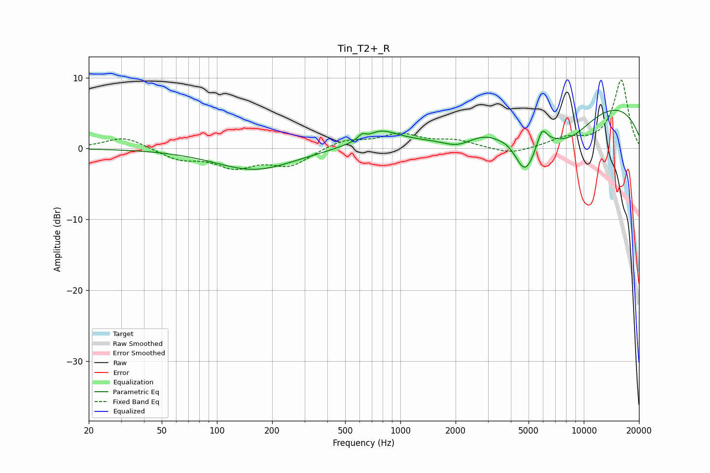

# Tin_T2+_R
See [usage instructions](https://github.com/jaakkopasanen/AutoEq#usage) for more options and info.

### Parametric EQs
Apply preamp of -5.5 dB when using parametric equalizer.

|   # | Type    |   Fc (Hz) |    Q |   Gain (dB) |
|-----|---------|-----------|------|-------------|
|   1 | Peaking |       160 | 0.66 |        -3   |
|   2 | Peaking |       620 | 5.66 |         1.5 |
|   3 | Peaking |       631 | 3.74 |        -1.3 |
|   4 | Peaking |       752 | 1.33 |         2.5 |
|   5 | Peaking |      2055 | 1.59 |        -1.7 |
|   6 | Peaking |      3417 | 3.1  |        -0.4 |
|   7 | Peaking |      4786 | 2.23 |        -6.5 |
|   8 | Peaking |      5920 | 5.19 |         2.4 |
|   9 | Peaking |      8162 | 0.84 |        -5.2 |
|  10 | Peaking |     10000 | 0.23 |         7.5 |

### Fixed Band EQs
When using fixed band (also called graphic) equalizer, apply preamp of **-9.7 dB** (if available) and set gains manually with these parameters.

|   # | Type    |   Fc (Hz) |    Q |   Gain (dB) |
|-----|---------|-----------|------|-------------|
|   1 | Peaking |        31 | 1.41 |         1.7 |
|   2 | Peaking |        62 | 1.41 |        -1.5 |
|   3 | Peaking |       125 | 1.41 |        -2.4 |
|   4 | Peaking |       250 | 1.41 |        -2.3 |
|   5 | Peaking |       500 | 1.41 |         1.2 |
|   6 | Peaking |      1000 | 1.41 |         1.9 |
|   7 | Peaking |      2000 | 1.41 |         1   |
|   8 | Peaking |      4000 | 1.41 |        -0.9 |
|   9 | Peaking |      8000 | 1.41 |         1.3 |
|  10 | Peaking |     16000 | 1.41 |         9.6 |

### Graphs

