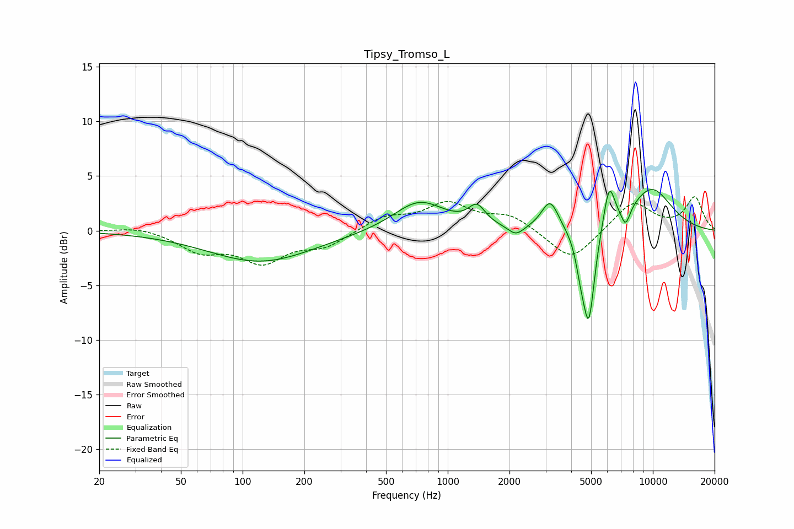

# Tipsy_Tromso_L
See [usage instructions](https://github.com/jaakkopasanen/AutoEq#usage) for more options and info.

### Parametric EQs
Apply preamp of -3.9 dB when using parametric equalizer.

|   # | Type    |   Fc (Hz) |    Q |   Gain (dB) |
|-----|---------|-----------|------|-------------|
|   1 | Peaking |       122 | 0.55 |        -2.8 |
|   2 | Peaking |       726 | 1.14 |         2.8 |
|   3 | Peaking |      1388 | 3.46 |         1.7 |
|   4 | Peaking |      2150 | 3.61 |        -0.9 |
|   5 | Peaking |      3155 | 3.38 |         2.7 |
|   6 | Peaking |      4445 | 5.99 |        -1.9 |
|   7 | Peaking |      4872 | 4.72 |        -8.7 |
|   8 | Peaking |      6124 | 4.91 |         3.9 |
|   9 | Peaking |      7368 | 5.99 |        -1.7 |
|  10 | Peaking |      9834 | 1.13 |         3.8 |

### Fixed Band EQs
When using fixed band (also called graphic) equalizer, apply preamp of **-3.2 dB** (if available) and set gains manually with these parameters.

|   # | Type    |   Fc (Hz) |    Q |   Gain (dB) |
|-----|---------|-----------|------|-------------|
|   1 | Peaking |        31 | 1.41 |         0.4 |
|   2 | Peaking |        62 | 1.41 |        -1.7 |
|   3 | Peaking |       125 | 1.41 |        -2.7 |
|   4 | Peaking |       250 | 1.41 |        -1.3 |
|   5 | Peaking |       500 | 1.41 |         1.2 |
|   6 | Peaking |      1000 | 1.41 |         2.3 |
|   7 | Peaking |      2000 | 1.41 |         1.3 |
|   8 | Peaking |      4000 | 1.41 |        -2.9 |
|   9 | Peaking |      8000 | 1.41 |         2.7 |
|  10 | Peaking |     16000 | 1.41 |         3   |

### Graphs

