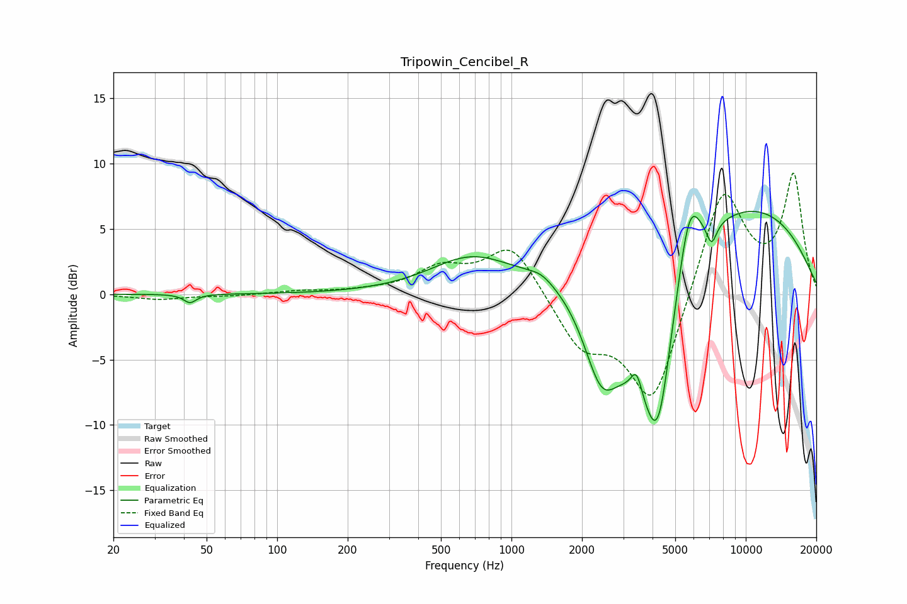

# Tripowin_Cencibel_R
See [usage instructions](https://github.com/jaakkopasanen/AutoEq#usage) for more options and info.

### Parametric EQs
Apply preamp of -6.4 dB when using parametric equalizer.

|   # | Type    |   Fc (Hz) |    Q |   Gain (dB) |
|-----|---------|-----------|------|-------------|
|   1 | Peaking |        42 | 5.38 |        -0.7 |
|   2 | Peaking |       660 | 0.83 |         2.4 |
|   3 | Peaking |      1342 | 2.84 |         0.5 |
|   4 | Peaking |      2416 | 1.78 |        -6.4 |
|   5 | Peaking |      3420 | 5.85 |         2   |
|   6 | Peaking |      3681 | 0.89 |       -10.4 |
|   7 | Peaking |      4234 | 2.52 |        -8   |
|   8 | Peaking |      5736 | 2.71 |         5.6 |
|   9 | Peaking |      6749 | 0.24 |         8.5 |
|  10 | Peaking |      7147 | 6    |        -1.7 |

### Fixed Band EQs
When using fixed band (also called graphic) equalizer, apply preamp of **-9.3 dB** (if available) and set gains manually with these parameters.

|   # | Type    |   Fc (Hz) |    Q |   Gain (dB) |
|-----|---------|-----------|------|-------------|
|   1 | Peaking |        31 | 1.41 |        -0.4 |
|   2 | Peaking |        62 | 1.41 |        -0.1 |
|   3 | Peaking |       125 | 1.41 |         0.2 |
|   4 | Peaking |       250 | 1.41 |         0.2 |
|   5 | Peaking |       500 | 1.41 |         1.8 |
|   6 | Peaking |      1000 | 1.41 |         3.9 |
|   7 | Peaking |      2000 | 1.41 |        -3.8 |
|   8 | Peaking |      4000 | 1.41 |        -8.6 |
|   9 | Peaking |      8000 | 1.41 |         8.5 |
|  10 | Peaking |     16000 | 1.41 |         8.9 |

### Graphs

