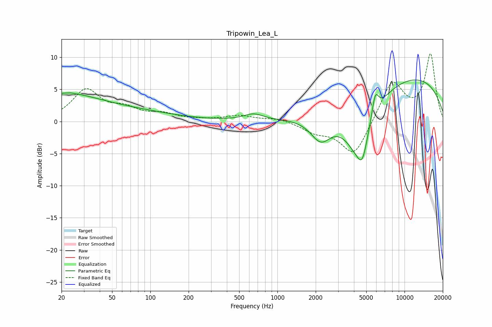

# Tripowin_Lea_L
See [usage instructions](https://github.com/jaakkopasanen/AutoEq#usage) for more options and info.

### Parametric EQs
Apply preamp of -6.6 dB when using parametric equalizer.

|   # | Type    |   Fc (Hz) |    Q |   Gain (dB) |
|-----|---------|-----------|------|-------------|
|   1 | Peaking |        20 | 0.49 |         4   |
|   2 | Peaking |        22 | 5.97 |        -2.8 |
|   3 | Peaking |        22 | 5.84 |         2.9 |
|   4 | Peaking |        76 | 0.43 |         1.2 |
|   5 | Peaking |       648 | 1.85 |         1   |
|   6 | Peaking |      2192 | 1.74 |        -3.8 |
|   7 | Peaking |      4402 | 1.23 |        -9.1 |
|   8 | Peaking |      4657 | 4.22 |        -2.5 |
|   9 | Peaking |      5877 | 5.01 |         3.8 |
|  10 | Peaking |     10000 | 0.25 |         7.2 |

### Fixed Band EQs
When using fixed band (also called graphic) equalizer, apply preamp of **-10.6 dB** (if available) and set gains manually with these parameters.

|   # | Type    |   Fc (Hz) |    Q |   Gain (dB) |
|-----|---------|-----------|------|-------------|
|   1 | Peaking |        31 | 1.41 |         4.8 |
|   2 | Peaking |        62 | 1.41 |         1.6 |
|   3 | Peaking |       125 | 1.41 |         1   |
|   4 | Peaking |       250 | 1.41 |         0.2 |
|   5 | Peaking |       500 | 1.41 |         0.9 |
|   6 | Peaking |      1000 | 1.41 |         0.5 |
|   7 | Peaking |      2000 | 1.41 |        -1.4 |
|   8 | Peaking |      4000 | 1.41 |        -5.5 |
|   9 | Peaking |      8000 | 1.41 |         6.3 |
|  10 | Peaking |     16000 | 1.41 |        10.3 |

### Graphs

