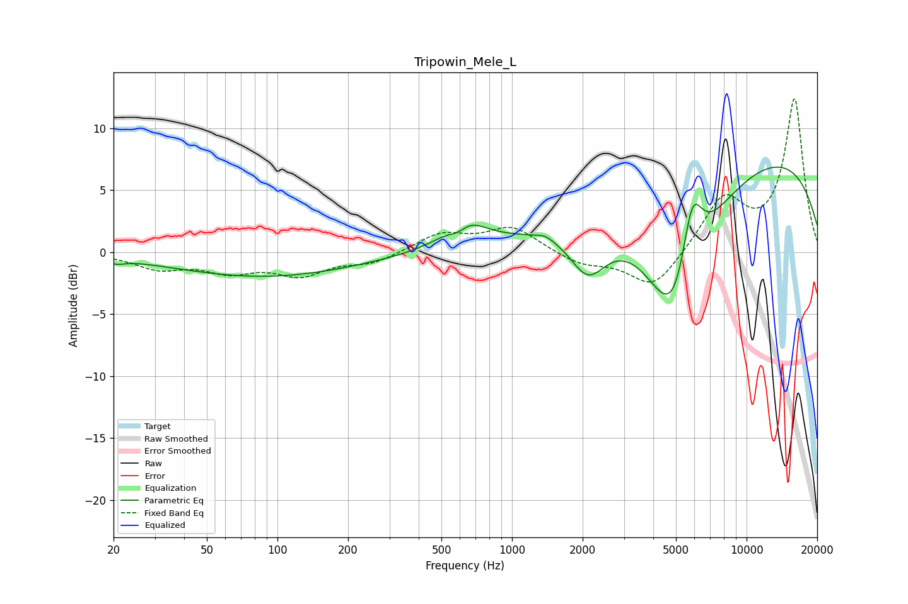

# Tripowin_Mele_L
See [usage instructions](https://github.com/jaakkopasanen/AutoEq#usage) for more options and info.

### Parametric EQs
Apply preamp of -7.0 dB when using parametric equalizer.

|   # | Type    |   Fc (Hz) |    Q |   Gain (dB) |
|-----|---------|-----------|------|-------------|
|   1 | Peaking |        21 | 4.07 |        -0.4 |
|   2 | Peaking |        35 | 1.14 |         0   |
|   3 | Peaking |        88 | 0.36 |        -2   |
|   4 | Peaking |       590 | 3.08 |        -1.3 |
|   5 | Peaking |       617 | 1.71 |         2.7 |
|   6 | Peaking |      1386 | 4.14 |         0.3 |
|   7 | Peaking |      2107 | 1.74 |        -4   |
|   8 | Peaking |      4968 | 0.99 |       -13.6 |
|   9 | Peaking |      5849 | 2.91 |         6.7 |
|  10 | Peaking |      8565 | 0.19 |         8.9 |

### Fixed Band EQs
When using fixed band (also called graphic) equalizer, apply preamp of **-12.5 dB** (if available) and set gains manually with these parameters.

|   # | Type    |   Fc (Hz) |    Q |   Gain (dB) |
|-----|---------|-----------|------|-------------|
|   1 | Peaking |        31 | 1.41 |        -1.2 |
|   2 | Peaking |        62 | 1.41 |        -1.4 |
|   3 | Peaking |       125 | 1.41 |        -1.7 |
|   4 | Peaking |       250 | 1.41 |        -0.8 |
|   5 | Peaking |       500 | 1.41 |         1.5 |
|   6 | Peaking |      1000 | 1.41 |         2   |
|   7 | Peaking |      2000 | 1.41 |        -1   |
|   8 | Peaking |      4000 | 1.41 |        -3   |
|   9 | Peaking |      8000 | 1.41 |         4.3 |
|  10 | Peaking |     16000 | 1.41 |        12.3 |

### Graphs

