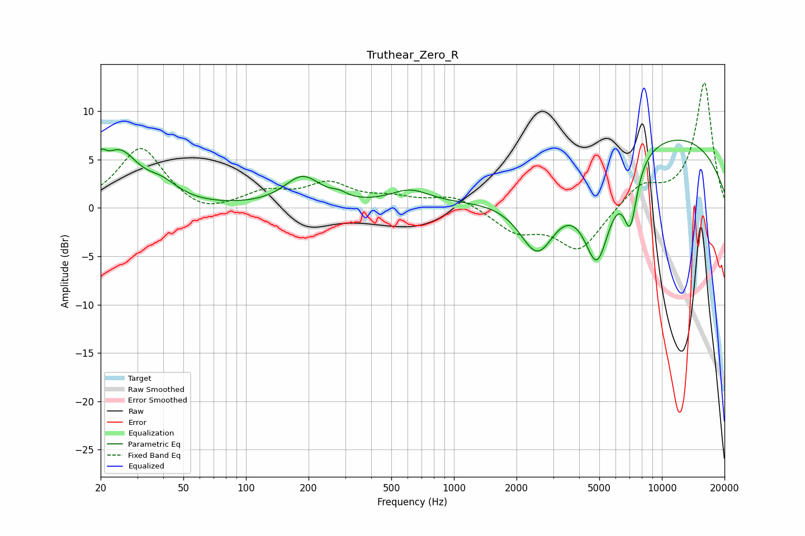

# Truthear_Zero_R
See [usage instructions](https://github.com/jaakkopasanen/AutoEq#usage) for more options and info.

### Parametric EQs
Apply preamp of -7.1 dB when using parametric equalizer.

|   # | Type    |   Fc (Hz) |    Q |   Gain (dB) |
|-----|---------|-----------|------|-------------|
|   1 | Peaking |        20 | 5.88 |         2   |
|   2 | Peaking |        25 | 1.54 |         5.3 |
|   3 | Peaking |        40 | 1.79 |         1.5 |
|   4 | Peaking |       187 | 1.61 |         3   |
|   5 | Peaking |       281 | 3.72 |         0.5 |
|   6 | Peaking |       614 | 1.46 |         1.6 |
|   7 | Peaking |      2529 | 1.52 |        -7   |
|   8 | Peaking |      4881 | 1.98 |       -10.2 |
|   9 | Peaking |      7049 | 4.09 |        -6.1 |
|  10 | Peaking |      9570 | 0.25 |         7.9 |

### Fixed Band EQs
When using fixed band (also called graphic) equalizer, apply preamp of **-13.0 dB** (if available) and set gains manually with these parameters.

|   # | Type    |   Fc (Hz) |    Q |   Gain (dB) |
|-----|---------|-----------|------|-------------|
|   1 | Peaking |        31 | 1.41 |         6.2 |
|   2 | Peaking |        62 | 1.41 |        -1   |
|   3 | Peaking |       125 | 1.41 |         1.5 |
|   4 | Peaking |       250 | 1.41 |         2.3 |
|   5 | Peaking |       500 | 1.41 |         0.8 |
|   6 | Peaking |      1000 | 1.41 |         1.3 |
|   7 | Peaking |      2000 | 1.41 |        -2.3 |
|   8 | Peaking |      4000 | 1.41 |        -4.4 |
|   9 | Peaking |      8000 | 1.41 |         2.3 |
|  10 | Peaking |     16000 | 1.41 |        13   |

### Graphs

