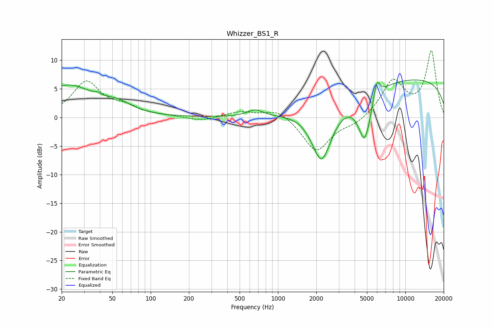

# Whizzer_BS1_R
See [usage instructions](https://github.com/jaakkopasanen/AutoEq#usage) for more options and info.

### Parametric EQs
Apply preamp of -6.6 dB when using parametric equalizer.

|   # | Type    |   Fc (Hz) |    Q |   Gain (dB) |
|-----|---------|-----------|------|-------------|
|   1 | Peaking |        22 | 0.68 |         5.5 |
|   2 | Peaking |        40 | 5.6  |         3.1 |
|   3 | Peaking |        40 | 5.99 |        -2.8 |
|   4 | Peaking |        56 | 1.35 |         1.4 |
|   5 | Peaking |       662 | 2.31 |         1.2 |
|   6 | Peaking |      1510 | 2.41 |         0.3 |
|   7 | Peaking |      2202 | 1.66 |       -10.4 |
|   8 | Peaking |      4800 | 2.61 |        -8.7 |
|   9 | Peaking |      5953 | 5.29 |         3.6 |
|  10 | Peaking |     10000 | 0.18 |         6.9 |

### Fixed Band EQs
When using fixed band (also called graphic) equalizer, apply preamp of **-11.7 dB** (if available) and set gains manually with these parameters.

|   # | Type    |   Fc (Hz) |    Q |   Gain (dB) |
|-----|---------|-----------|------|-------------|
|   1 | Peaking |        31 | 1.41 |         6.1 |
|   2 | Peaking |        62 | 1.41 |         1.5 |
|   3 | Peaking |       125 | 1.41 |         0.2 |
|   4 | Peaking |       250 | 1.41 |        -0.7 |
|   5 | Peaking |       500 | 1.41 |         1   |
|   6 | Peaking |      1000 | 1.41 |         1.6 |
|   7 | Peaking |      2000 | 1.41 |        -6   |
|   8 | Peaking |      4000 | 1.41 |        -1.1 |
|   9 | Peaking |      8000 | 1.41 |         6.3 |
|  10 | Peaking |     16000 | 1.41 |        11.4 |

### Graphs

