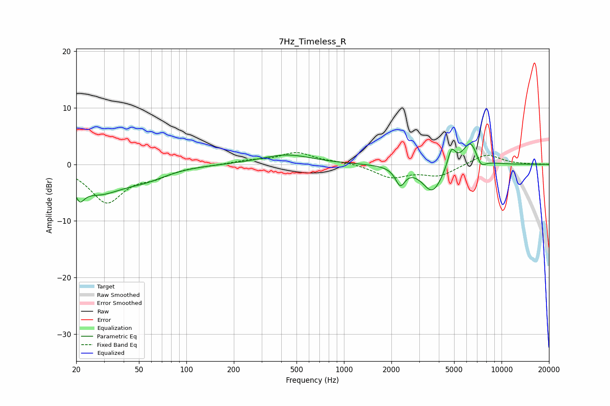

# 7Hz_Timeless_R
See [usage instructions](https://github.com/jaakkopasanen/AutoEq#usage) for more options and info.

### Parametric EQs
Apply preamp of -3.7 dB when using parametric equalizer.

|   # | Type    |   Fc (Hz) |    Q |   Gain (dB) |
|-----|---------|-----------|------|-------------|
|   1 | Peaking |        21 | 5.43 |        -5.9 |
|   2 | Peaking |        21 | 5.98 |         3.2 |
|   3 | Peaking |        28 | 0.89 |        -4.6 |
|   4 | Peaking |        56 | 1.03 |        -1.7 |
|   5 | Peaking |       433 | 0.89 |         1.7 |
|   6 | Peaking |      2275 | 4.65 |        -3.1 |
|   7 | Peaking |      3643 | 2.17 |        -5   |
|   8 | Peaking |      4807 | 5.56 |         3.4 |
|   9 | Peaking |      6365 | 2.7  |         4.5 |
|  10 | Peaking |      7369 | 4.24 |        -2   |

### Fixed Band EQs
When using fixed band (also called graphic) equalizer, apply preamp of **-2.2 dB** (if available) and set gains manually with these parameters.

|   # | Type    |   Fc (Hz) |    Q |   Gain (dB) |
|-----|---------|-----------|------|-------------|
|   1 | Peaking |        31 | 1.41 |        -6.5 |
|   2 | Peaking |        62 | 1.41 |        -1.6 |
|   3 | Peaking |       125 | 1.41 |        -0.1 |
|   4 | Peaking |       250 | 1.41 |         0.6 |
|   5 | Peaking |       500 | 1.41 |         2   |
|   6 | Peaking |      1000 | 1.41 |         0.4 |
|   7 | Peaking |      2000 | 1.41 |        -2.2 |
|   8 | Peaking |      4000 | 1.41 |        -1.9 |
|   9 | Peaking |      8000 | 1.41 |         1.9 |
|  10 | Peaking |     16000 | 1.41 |         0   |

### Graphs

