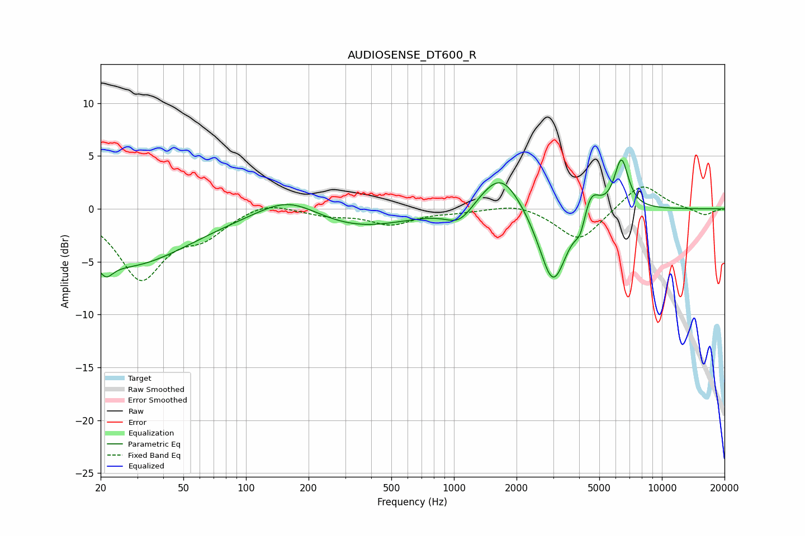

# AUDIOSENSE_DT600_R
See [usage instructions](https://github.com/jaakkopasanen/AutoEq#usage) for more options and info.

### Parametric EQs
Apply preamp of -4.7 dB when using parametric equalizer.

|   # | Type    |   Fc (Hz) |    Q |   Gain (dB) |
|-----|---------|-----------|------|-------------|
|   1 | Peaking |        21 | 4.29 |        -1.4 |
|   2 | Peaking |        27 | 0.48 |        -5.3 |
|   3 | Peaking |       160 | 0.96 |         2   |
|   4 | Peaking |       335 | 0.57 |        -1.9 |
|   5 | Peaking |      1064 | 2.14 |        -1.6 |
|   6 | Peaking |      1681 | 1.4  |         4   |
|   7 | Peaking |      2994 | 2.08 |        -7.5 |
|   8 | Peaking |      4056 | 5.64 |        -1.7 |
|   9 | Peaking |      4555 | 3.44 |         2.5 |
|  10 | Peaking |      6388 | 4.03 |         4.8 |

### Fixed Band EQs
When using fixed band (also called graphic) equalizer, apply preamp of **-2.2 dB** (if available) and set gains manually with these parameters.

|   # | Type    |   Fc (Hz) |    Q |   Gain (dB) |
|-----|---------|-----------|------|-------------|
|   1 | Peaking |        31 | 1.41 |        -6.4 |
|   2 | Peaking |        62 | 1.41 |        -2.1 |
|   3 | Peaking |       125 | 1.41 |         0.8 |
|   4 | Peaking |       250 | 1.41 |        -0.5 |
|   5 | Peaking |       500 | 1.41 |        -1.4 |
|   6 | Peaking |      1000 | 1.41 |        -0.2 |
|   7 | Peaking |      2000 | 1.41 |         0.6 |
|   8 | Peaking |      4000 | 1.41 |        -3.1 |
|   9 | Peaking |      8000 | 1.41 |         2.5 |
|  10 | Peaking |     16000 | 1.41 |        -0.6 |

### Graphs

