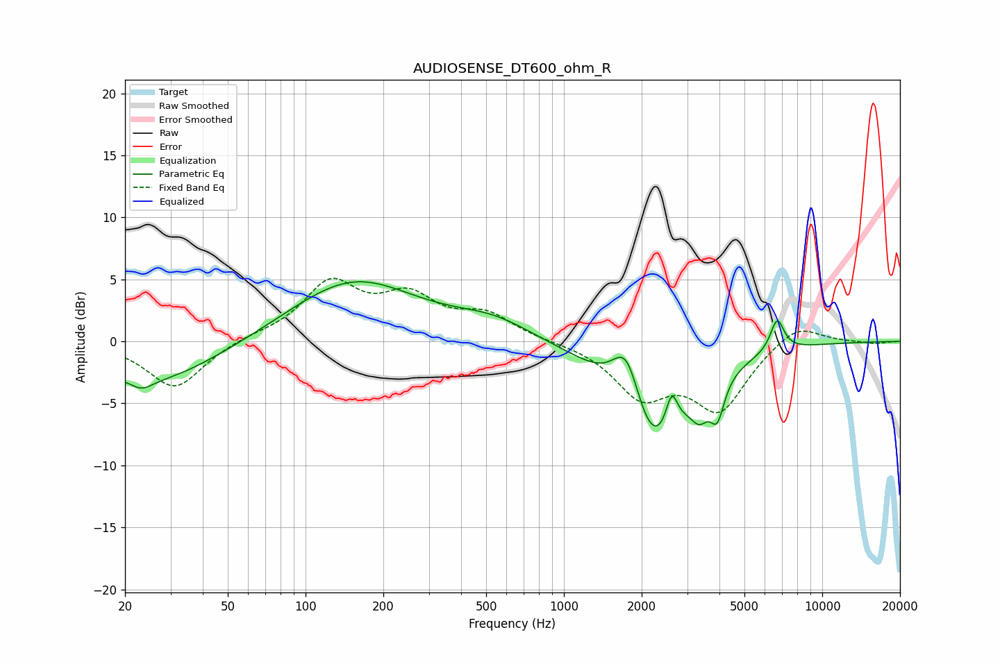

# AUDIOSENSE_DT600_ohm_R
See [usage instructions](https://github.com/jaakkopasanen/AutoEq#usage) for more options and info.

### Parametric EQs
Apply preamp of -4.9 dB when using parametric equalizer.

|   # | Type    |   Fc (Hz) |    Q |   Gain (dB) |
|-----|---------|-----------|------|-------------|
|   1 | Peaking |        23 | 3.63 |        -0.7 |
|   2 | Peaking |        25 | 0.55 |        -3.4 |
|   3 | Peaking |       153 | 0.58 |         5   |
|   4 | Peaking |       533 | 0.9  |         1.5 |
|   5 | Peaking |      1753 | 2.43 |         5.5 |
|   6 | Peaking |      2194 | 1.1  |        -9.7 |
|   7 | Peaking |      2614 | 6    |         3   |
|   8 | Peaking |      3352 | 4.28 |        -1.9 |
|   9 | Peaking |      3923 | 5.12 |        -3   |
|  10 | Peaking |      6691 | 5.12 |         2.6 |

### Fixed Band EQs
When using fixed band (also called graphic) equalizer, apply preamp of **-5.2 dB** (if available) and set gains manually with these parameters.

|   # | Type    |   Fc (Hz) |    Q |   Gain (dB) |
|-----|---------|-----------|------|-------------|
|   1 | Peaking |        31 | 1.41 |        -3.8 |
|   2 | Peaking |        62 | 1.41 |         0.3 |
|   3 | Peaking |       125 | 1.41 |         4.5 |
|   4 | Peaking |       250 | 1.41 |         3.2 |
|   5 | Peaking |       500 | 1.41 |         2   |
|   6 | Peaking |      1000 | 1.41 |        -0   |
|   7 | Peaking |      2000 | 1.41 |        -4.1 |
|   8 | Peaking |      4000 | 1.41 |        -5.2 |
|   9 | Peaking |      8000 | 1.41 |         1.6 |
|  10 | Peaking |     16000 | 1.41 |        -0.2 |

### Graphs

