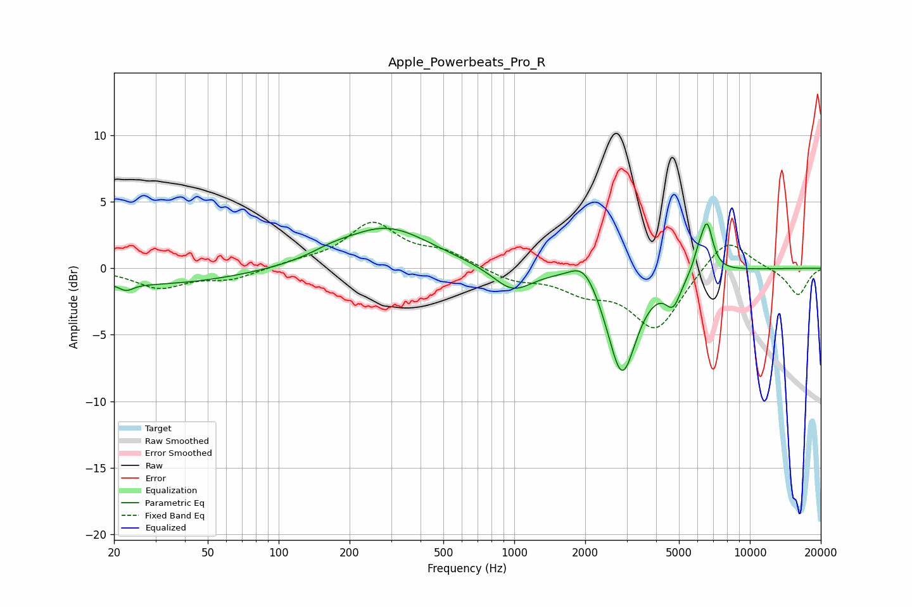

# Apple_Powerbeats_Pro_R
See [usage instructions](https://github.com/jaakkopasanen/AutoEq#usage) for more options and info.

### Parametric EQs
Apply preamp of -3.4 dB when using parametric equalizer.

|   # | Type    |   Fc (Hz) |    Q |   Gain (dB) |
|-----|---------|-----------|------|-------------|
|   1 | Peaking |        23 | 4.75 |        -0.5 |
|   2 | Peaking |        28 | 0.37 |        -1.2 |
|   3 | Peaking |       167 | 1.75 |         0.4 |
|   4 | Peaking |       286 | 0.75 |         3.1 |
|   5 | Peaking |       982 | 1.69 |        -1.8 |
|   6 | Peaking |      1983 | 2.37 |         1.8 |
|   7 | Peaking |      2864 | 2.25 |        -8   |
|   8 | Peaking |      4728 | 4.17 |        -2   |
|   9 | Peaking |      6066 | 6    |         1.1 |
|  10 | Peaking |      6584 | 5.53 |         3.5 |

### Fixed Band EQs
When using fixed band (also called graphic) equalizer, apply preamp of **-3.6 dB** (if available) and set gains manually with these parameters.

|   # | Type    |   Fc (Hz) |    Q |   Gain (dB) |
|-----|---------|-----------|------|-------------|
|   1 | Peaking |        31 | 1.41 |        -1.4 |
|   2 | Peaking |        62 | 1.41 |        -0.8 |
|   3 | Peaking |       125 | 1.41 |         0.4 |
|   4 | Peaking |       250 | 1.41 |         3.3 |
|   5 | Peaking |       500 | 1.41 |         1.1 |
|   6 | Peaking |      1000 | 1.41 |        -0.9 |
|   7 | Peaking |      2000 | 1.41 |        -1.5 |
|   8 | Peaking |      4000 | 1.41 |        -4.5 |
|   9 | Peaking |      8000 | 1.41 |         2.5 |
|  10 | Peaking |     16000 | 1.41 |        -2.1 |

### Graphs

