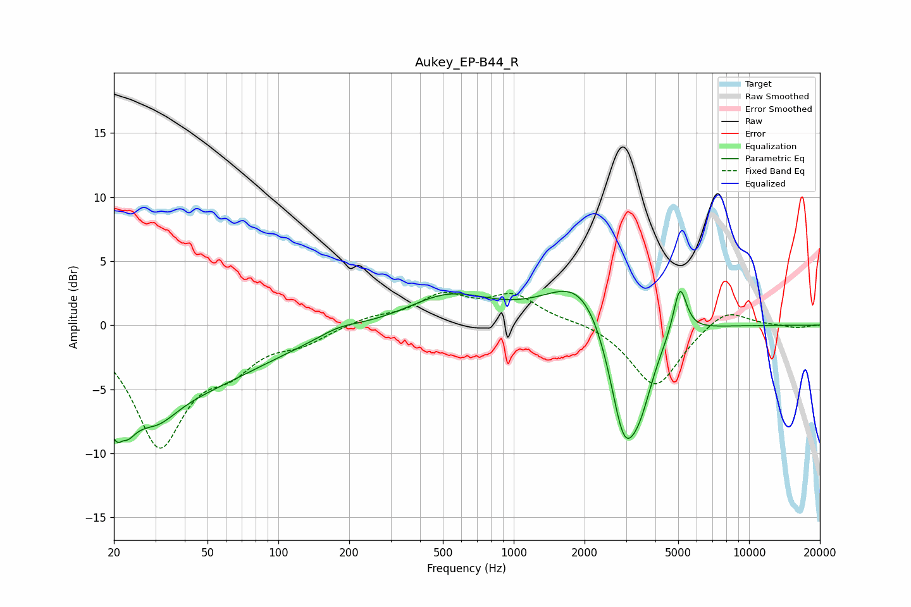

# Aukey_EP-B44_R
See [usage instructions](https://github.com/jaakkopasanen/AutoEq#usage) for more options and info.

### Parametric EQs
Apply preamp of -2.8 dB when using parametric equalizer.

|   # | Type    |   Fc (Hz) |    Q |   Gain (dB) |
|-----|---------|-----------|------|-------------|
|   1 | Peaking |        21 | 3.84 |        -6.3 |
|   2 | Peaking |        22 | 5.6  |         3.4 |
|   3 | Peaking |        27 | 0.31 |        -5.6 |
|   4 | Peaking |        31 | 1.75 |        -1.6 |
|   5 | Peaking |       181 | 1.66 |         0.5 |
|   6 | Peaking |       530 | 0.81 |         2.3 |
|   7 | Peaking |      1980 | 0.98 |         4.3 |
|   8 | Peaking |      2936 | 2.11 |        -9.4 |
|   9 | Peaking |      3456 | 2.55 |        -3.4 |
|  10 | Peaking |      5085 | 4.96 |         3.9 |

### Fixed Band EQs
When using fixed band (also called graphic) equalizer, apply preamp of **-2.7 dB** (if available) and set gains manually with these parameters.

|   # | Type    |   Fc (Hz) |    Q |   Gain (dB) |
|-----|---------|-----------|------|-------------|
|   1 | Peaking |        31 | 1.41 |        -9.1 |
|   2 | Peaking |        62 | 1.41 |        -2.5 |
|   3 | Peaking |       125 | 1.41 |        -1.1 |
|   4 | Peaking |       250 | 1.41 |         0.6 |
|   5 | Peaking |       500 | 1.41 |         2.1 |
|   6 | Peaking |      1000 | 1.41 |         2.2 |
|   7 | Peaking |      2000 | 1.41 |         0.3 |
|   8 | Peaking |      4000 | 1.41 |        -4.9 |
|   9 | Peaking |      8000 | 1.41 |         1.5 |
|  10 | Peaking |     16000 | 1.41 |        -0.2 |

### Graphs

