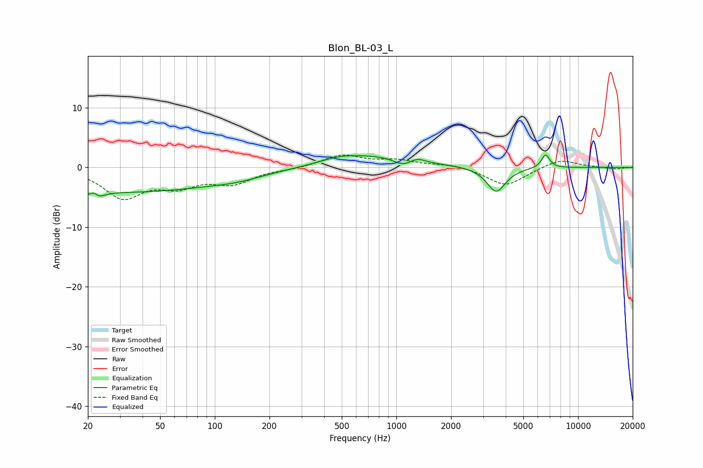

# Blon_BL-03_L
See [usage instructions](https://github.com/jaakkopasanen/AutoEq#usage) for more options and info.

### Parametric EQs
Apply preamp of -2.2 dB when using parametric equalizer.

|   # | Type    |   Fc (Hz) |    Q |   Gain (dB) |
|-----|---------|-----------|------|-------------|
|   1 | Peaking |        22 | 5.89 |         3.3 |
|   2 | Peaking |        22 | 4.43 |        -3.8 |
|   3 | Peaking |        33 | 0.26 |        -4   |
|   4 | Peaking |       133 | 1.03 |        -0.6 |
|   5 | Peaking |       479 | 1.46 |         0.7 |
|   6 | Peaking |       733 | 0.62 |         1.9 |
|   7 | Peaking |      1088 | 2.75 |        -1.1 |
|   8 | Peaking |      1302 | 3.4  |         0.8 |
|   9 | Peaking |      3545 | 2.72 |        -4.2 |
|  10 | Peaking |      6628 | 6    |         2.3 |

### Fixed Band EQs
When using fixed band (also called graphic) equalizer, apply preamp of **-2.2 dB** (if available) and set gains manually with these parameters.

|   # | Type    |   Fc (Hz) |    Q |   Gain (dB) |
|-----|---------|-----------|------|-------------|
|   1 | Peaking |        31 | 1.41 |        -4.8 |
|   2 | Peaking |        62 | 1.41 |        -2.6 |
|   3 | Peaking |       125 | 1.41 |        -2.4 |
|   4 | Peaking |       250 | 1.41 |        -0.2 |
|   5 | Peaking |       500 | 1.41 |         2   |
|   6 | Peaking |      1000 | 1.41 |         1.1 |
|   7 | Peaking |      2000 | 1.41 |         0.5 |
|   8 | Peaking |      4000 | 1.41 |        -3.1 |
|   9 | Peaking |      8000 | 1.41 |         1.5 |
|  10 | Peaking |     16000 | 1.41 |        -0.3 |

### Graphs

