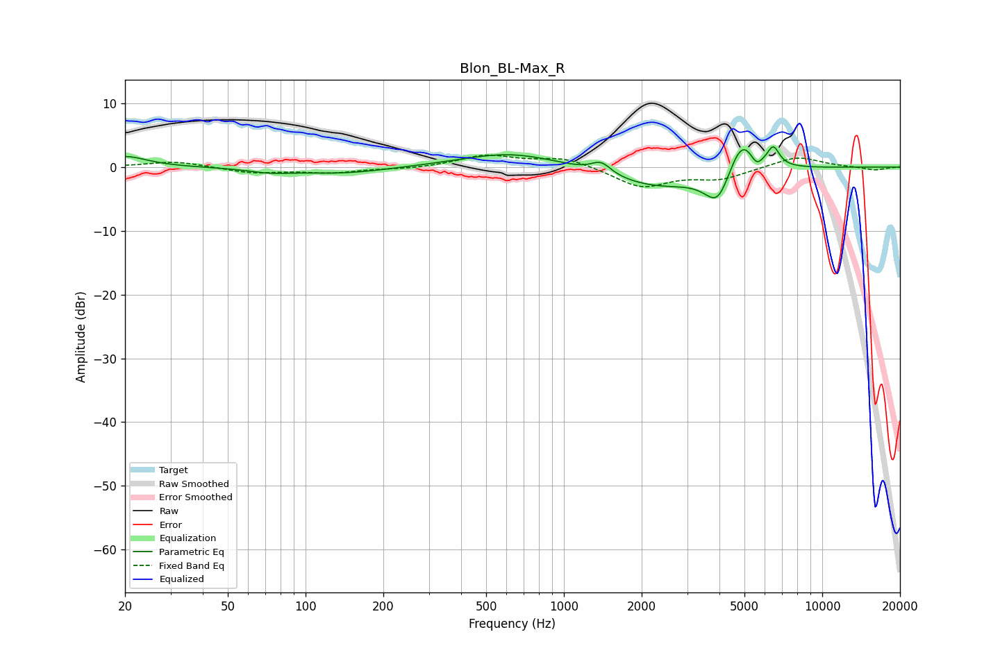

# Blon_BL-Max_R
See [usage instructions](https://github.com/jaakkopasanen/AutoEq#usage) for more options and info.

### Parametric EQs
Apply preamp of -3.3 dB when using parametric equalizer.

|   # | Type    |   Fc (Hz) |    Q |   Gain (dB) |
|-----|---------|-----------|------|-------------|
|   1 | Peaking |        20 | 1.69 |         1.7 |
|   2 | Peaking |        73 | 1.68 |        -0.6 |
|   3 | Peaking |       139 | 0.8  |        -1   |
|   4 | Peaking |       629 | 0.74 |         2.4 |
|   5 | Peaking |      1394 | 3.76 |         1.8 |
|   6 | Peaking |      2292 | 0.73 |        -3.2 |
|   7 | Peaking |      3952 | 2.73 |        -5.6 |
|   8 | Peaking |      4869 | 2.44 |         6.3 |
|   9 | Peaking |      5568 | 6    |        -1.8 |
|  10 | Peaking |      6469 | 5.95 |         2.9 |

### Fixed Band EQs
When using fixed band (also called graphic) equalizer, apply preamp of **-2.0 dB** (if available) and set gains manually with these parameters.

|   # | Type    |   Fc (Hz) |    Q |   Gain (dB) |
|-----|---------|-----------|------|-------------|
|   1 | Peaking |        31 | 1.41 |         0.9 |
|   2 | Peaking |        62 | 1.41 |        -0.9 |
|   3 | Peaking |       125 | 1.41 |        -0.8 |
|   4 | Peaking |       250 | 1.41 |        -0.3 |
|   5 | Peaking |       500 | 1.41 |         1.8 |
|   6 | Peaking |      1000 | 1.41 |         1.5 |
|   7 | Peaking |      2000 | 1.41 |        -3.1 |
|   8 | Peaking |      4000 | 1.41 |        -1.7 |
|   9 | Peaking |      8000 | 1.41 |         1.7 |
|  10 | Peaking |     16000 | 1.41 |        -0.5 |

### Graphs

