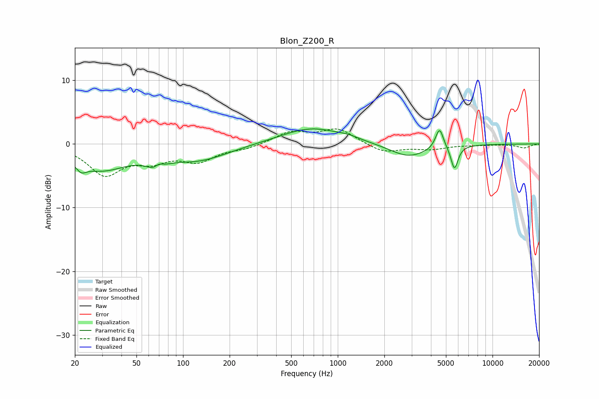

# Blon_Z200_R
See [usage instructions](https://github.com/jaakkopasanen/AutoEq#usage) for more options and info.

### Parametric EQs
Apply preamp of -2.5 dB when using parametric equalizer.

|   # | Type    |   Fc (Hz) |    Q |   Gain (dB) |
|-----|---------|-----------|------|-------------|
|   1 | Peaking |        22 | 4.44 |        -1.2 |
|   2 | Peaking |        29 | 0.79 |        -3.8 |
|   3 | Peaking |        68 | 2.81 |        -3.3 |
|   4 | Peaking |        69 | 3.93 |         2.4 |
|   5 | Peaking |       126 | 0.73 |        -2.4 |
|   6 | Peaking |       680 | 0.71 |         2.6 |
|   7 | Peaking |      1174 | 2.44 |         0.3 |
|   8 | Peaking |      2863 | 1.16 |        -2.1 |
|   9 | Peaking |      4542 | 5.53 |         3.3 |
|  10 | Peaking |      5677 | 6    |        -3.7 |

### Fixed Band EQs
When using fixed band (also called graphic) equalizer, apply preamp of **-2.5 dB** (if available) and set gains manually with these parameters.

|   # | Type    |   Fc (Hz) |    Q |   Gain (dB) |
|-----|---------|-----------|------|-------------|
|   1 | Peaking |        31 | 1.41 |        -4.6 |
|   2 | Peaking |        62 | 1.41 |        -2.2 |
|   3 | Peaking |       125 | 1.41 |        -2.4 |
|   4 | Peaking |       250 | 1.41 |        -0.6 |
|   5 | Peaking |       500 | 1.41 |         1.8 |
|   6 | Peaking |      1000 | 1.41 |         2.3 |
|   7 | Peaking |      2000 | 1.41 |        -1.4 |
|   8 | Peaking |      4000 | 1.41 |        -0.7 |
|   9 | Peaking |      8000 | 1.41 |        -0.1 |
|  10 | Peaking |     16000 | 1.41 |        -0.6 |

### Graphs

