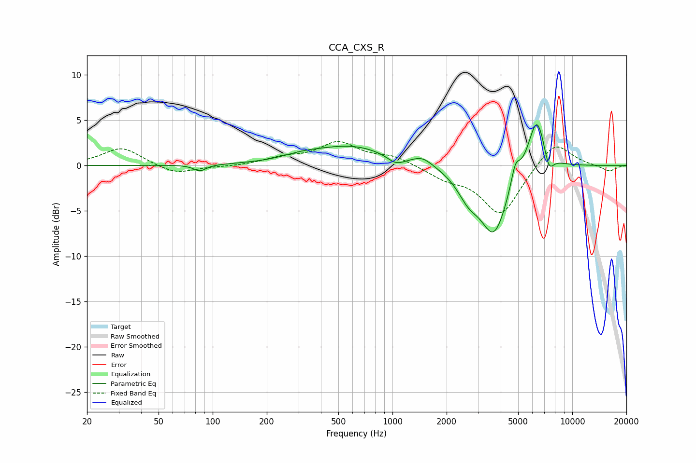

# CCA_CXS_R
See [usage instructions](https://github.com/jaakkopasanen/AutoEq#usage) for more options and info.

### Parametric EQs
Apply preamp of -4.6 dB when using parametric equalizer.

|   # | Type    |   Fc (Hz) |    Q |   Gain (dB) |
|-----|---------|-----------|------|-------------|
|   1 | Peaking |        85 | 4.16 |        -0.7 |
|   2 | Peaking |       314 | 1.33 |         0.5 |
|   3 | Peaking |       595 | 0.67 |         2.1 |
|   4 | Peaking |      1046 | 2.9  |        -0.9 |
|   5 | Peaking |      1471 | 2.55 |         0.9 |
|   6 | Peaking |      2641 | 2.28 |        -2.2 |
|   7 | Peaking |      3672 | 1.8  |        -7.4 |
|   8 | Peaking |      4824 | 5.67 |         2.2 |
|   9 | Peaking |      6361 | 2.78 |         6.2 |
|  10 | Peaking |      7397 | 4.89 |        -2.2 |

### Fixed Band EQs
When using fixed band (also called graphic) equalizer, apply preamp of **-2.7 dB** (if available) and set gains manually with these parameters.

|   # | Type    |   Fc (Hz) |    Q |   Gain (dB) |
|-----|---------|-----------|------|-------------|
|   1 | Peaking |        31 | 1.41 |         2   |
|   2 | Peaking |        62 | 1.41 |        -1   |
|   3 | Peaking |       125 | 1.41 |        -0.1 |
|   4 | Peaking |       250 | 1.41 |         0.7 |
|   5 | Peaking |       500 | 1.41 |         2.4 |
|   6 | Peaking |      1000 | 1.41 |         0.9 |
|   7 | Peaking |      2000 | 1.41 |        -1.2 |
|   8 | Peaking |      4000 | 1.41 |        -5.5 |
|   9 | Peaking |      8000 | 1.41 |         2.9 |
|  10 | Peaking |     16000 | 1.41 |        -0.7 |

### Graphs

