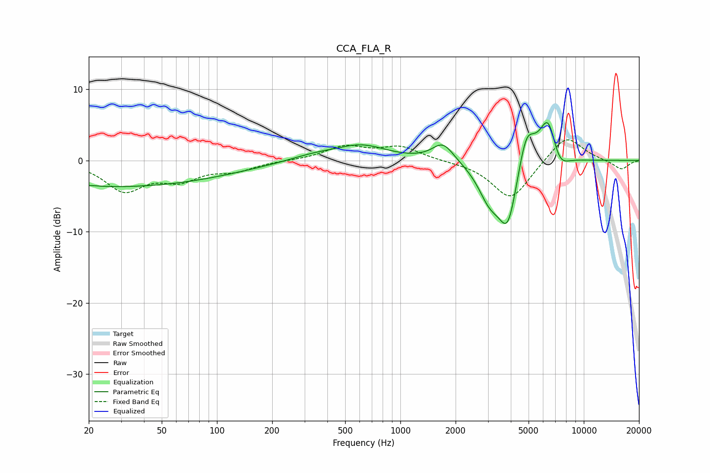

# CCA_FLA_R
See [usage instructions](https://github.com/jaakkopasanen/AutoEq#usage) for more options and info.

### Parametric EQs
Apply preamp of -5.4 dB when using parametric equalizer.

|   # | Type    |   Fc (Hz) |    Q |   Gain (dB) |
|-----|---------|-----------|------|-------------|
|   1 | Peaking |        20 | 2.6  |         0.2 |
|   2 | Peaking |        24 | 0.19 |        -3.7 |
|   3 | Peaking |       338 | 1.01 |         0.8 |
|   4 | Peaking |       615 | 1.02 |         2   |
|   5 | Peaking |      1708 | 2.41 |         2.6 |
|   6 | Peaking |      3057 | 2.22 |        -4.2 |
|   7 | Peaking |      3858 | 2.54 |        -9   |
|   8 | Peaking |      4857 | 2.97 |         5.7 |
|   9 | Peaking |      6408 | 2.79 |         6.9 |
|  10 | Peaking |      7277 | 2.7  |        -2.9 |

### Fixed Band EQs
When using fixed band (also called graphic) equalizer, apply preamp of **-3.0 dB** (if available) and set gains manually with these parameters.

|   # | Type    |   Fc (Hz) |    Q |   Gain (dB) |
|-----|---------|-----------|------|-------------|
|   1 | Peaking |        31 | 1.41 |        -4   |
|   2 | Peaking |        62 | 1.41 |        -2.4 |
|   3 | Peaking |       125 | 1.41 |        -1.3 |
|   4 | Peaking |       250 | 1.41 |         0   |
|   5 | Peaking |       500 | 1.41 |         1.9 |
|   6 | Peaking |      1000 | 1.41 |         1.8 |
|   7 | Peaking |      2000 | 1.41 |        -0.1 |
|   8 | Peaking |      4000 | 1.41 |        -5.6 |
|   9 | Peaking |      8000 | 1.41 |         3.7 |
|  10 | Peaking |     16000 | 1.41 |        -1.3 |

### Graphs

