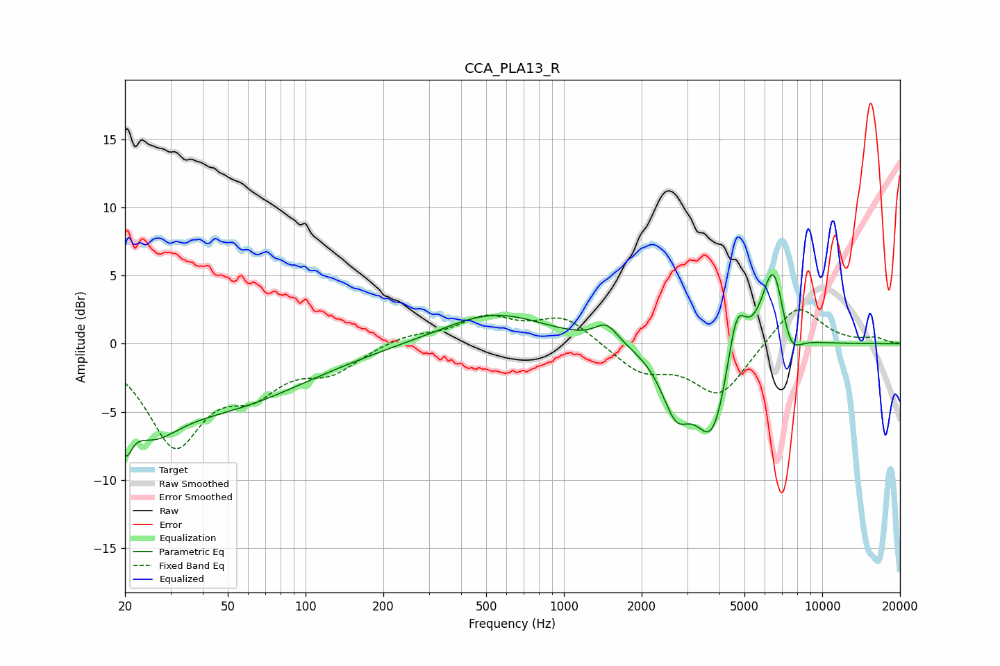

# CCA_PLA13_R
See [usage instructions](https://github.com/jaakkopasanen/AutoEq#usage) for more options and info.

### Parametric EQs
Apply preamp of -5.2 dB when using parametric equalizer.

|   # | Type    |   Fc (Hz) |    Q |   Gain (dB) |
|-----|---------|-----------|------|-------------|
|   1 | Peaking |        20 | 5.56 |        -3.1 |
|   2 | Peaking |        25 | 1.31 |        -3.5 |
|   3 | Peaking |        47 | 0.43 |        -4.3 |
|   4 | Peaking |       537 | 0.72 |         2.3 |
|   5 | Peaking |      1462 | 3.17 |         1.4 |
|   6 | Peaking |      2713 | 2.54 |        -4   |
|   7 | Peaking |      3764 | 2.04 |        -6.9 |
|   8 | Peaking |      4657 | 3.75 |         4.6 |
|   9 | Peaking |      6476 | 2.9  |         6.6 |
|  10 | Peaking |      7487 | 3.28 |        -2.4 |

### Fixed Band EQs
When using fixed band (also called graphic) equalizer, apply preamp of **-2.6 dB** (if available) and set gains manually with these parameters.

|   # | Type    |   Fc (Hz) |    Q |   Gain (dB) |
|-----|---------|-----------|------|-------------|
|   1 | Peaking |        31 | 1.41 |        -7.1 |
|   2 | Peaking |        62 | 1.41 |        -2.8 |
|   3 | Peaking |       125 | 1.41 |        -1.8 |
|   4 | Peaking |       250 | 1.41 |         0.6 |
|   5 | Peaking |       500 | 1.41 |         1.8 |
|   6 | Peaking |      1000 | 1.41 |         1.9 |
|   7 | Peaking |      2000 | 1.41 |        -2   |
|   8 | Peaking |      4000 | 1.41 |        -3.8 |
|   9 | Peaking |      8000 | 1.41 |         3   |
|  10 | Peaking |     16000 | 1.41 |         0.4 |

### Graphs

