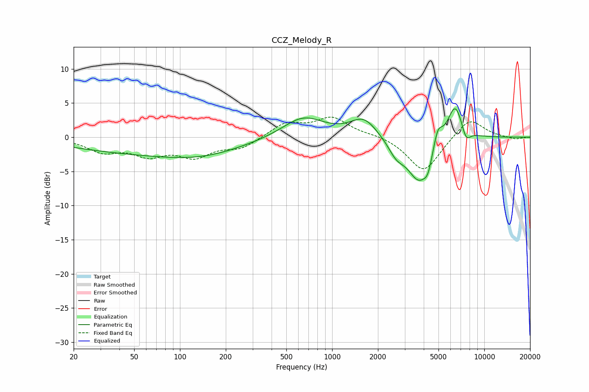

# CCZ_Melody_R
See [usage instructions](https://github.com/jaakkopasanen/AutoEq#usage) for more options and info.

### Parametric EQs
Apply preamp of -4.2 dB when using parametric equalizer.

|   # | Type    |   Fc (Hz) |    Q |   Gain (dB) |
|-----|---------|-----------|------|-------------|
|   1 | Peaking |        64 | 0.27 |        -2.3 |
|   2 | Peaking |       143 | 0.57 |        -1.1 |
|   3 | Peaking |       646 | 1.04 |         3.1 |
|   4 | Peaking |      1617 | 1.6  |         2.8 |
|   5 | Peaking |      2638 | 2.68 |        -1.9 |
|   6 | Peaking |      3741 | 1.74 |        -6.5 |
|   7 | Peaking |      4262 | 5.68 |        -1.7 |
|   8 | Peaking |      4952 | 4.8  |         2.8 |
|   9 | Peaking |      6433 | 2.61 |         5.5 |
|  10 | Peaking |      7580 | 4.6  |        -2   |

### Fixed Band EQs
When using fixed band (also called graphic) equalizer, apply preamp of **-3.0 dB** (if available) and set gains manually with these parameters.

|   # | Type    |   Fc (Hz) |    Q |   Gain (dB) |
|-----|---------|-----------|------|-------------|
|   1 | Peaking |        31 | 1.41 |        -1.9 |
|   2 | Peaking |        62 | 1.41 |        -2.3 |
|   3 | Peaking |       125 | 1.41 |        -2.6 |
|   4 | Peaking |       250 | 1.41 |        -1.5 |
|   5 | Peaking |       500 | 1.41 |         2   |
|   6 | Peaking |      1000 | 1.41 |         2.7 |
|   7 | Peaking |      2000 | 1.41 |         0.3 |
|   8 | Peaking |      4000 | 1.41 |        -5.2 |
|   9 | Peaking |      8000 | 1.41 |         3   |
|  10 | Peaking |     16000 | 1.41 |        -0.3 |

### Graphs

