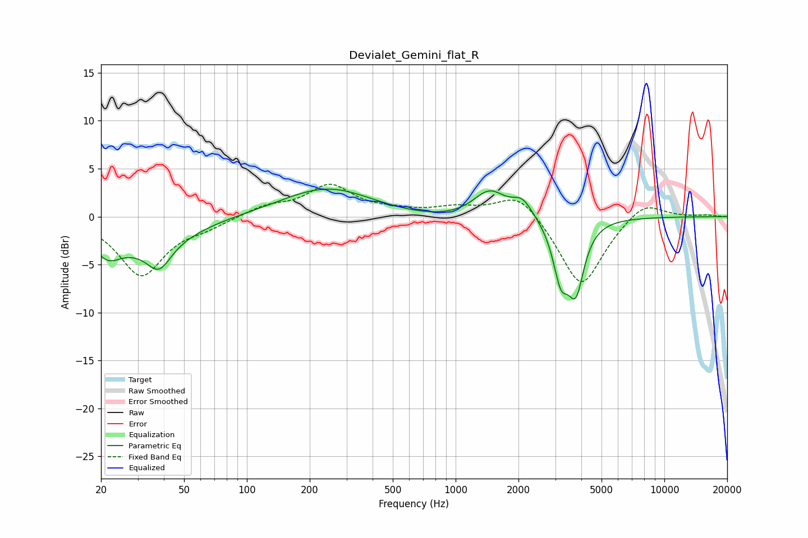

# Devialet_Gemini_flat_R
See [usage instructions](https://github.com/jaakkopasanen/AutoEq#usage) for more options and info.

### Parametric EQs
Apply preamp of -3.0 dB when using parametric equalizer.

|   # | Type    |   Fc (Hz) |    Q |   Gain (dB) |
|-----|---------|-----------|------|-------------|
|   1 | Peaking |        22 | 2.34 |        -2   |
|   2 | Peaking |        31 | 0.6  |        -2.8 |
|   3 | Peaking |        38 | 2.51 |        -2.8 |
|   4 | Peaking |        78 | 1.39 |         0.1 |
|   5 | Peaking |       245 | 0.64 |         3.2 |
|   6 | Peaking |       886 | 0.44 |        -0.6 |
|   7 | Peaking |      1452 | 1.8  |         2.9 |
|   8 | Peaking |      2091 | 2.88 |         1.8 |
|   9 | Peaking |      3191 | 3.8  |        -5.3 |
|  10 | Peaking |      3770 | 3.58 |        -6.7 |

### Fixed Band EQs
When using fixed band (also called graphic) equalizer, apply preamp of **-3.5 dB** (if available) and set gains manually with these parameters.

|   # | Type    |   Fc (Hz) |    Q |   Gain (dB) |
|-----|---------|-----------|------|-------------|
|   1 | Peaking |        31 | 1.41 |        -6.1 |
|   2 | Peaking |        62 | 1.41 |        -0.8 |
|   3 | Peaking |       125 | 1.41 |         1   |
|   4 | Peaking |       250 | 1.41 |         3.2 |
|   5 | Peaking |       500 | 1.41 |         0.4 |
|   6 | Peaking |      1000 | 1.41 |         0.8 |
|   7 | Peaking |      2000 | 1.41 |         2.7 |
|   8 | Peaking |      4000 | 1.41 |        -7.5 |
|   9 | Peaking |      8000 | 1.41 |         1.9 |
|  10 | Peaking |     16000 | 1.41 |         0.2 |

### Graphs

