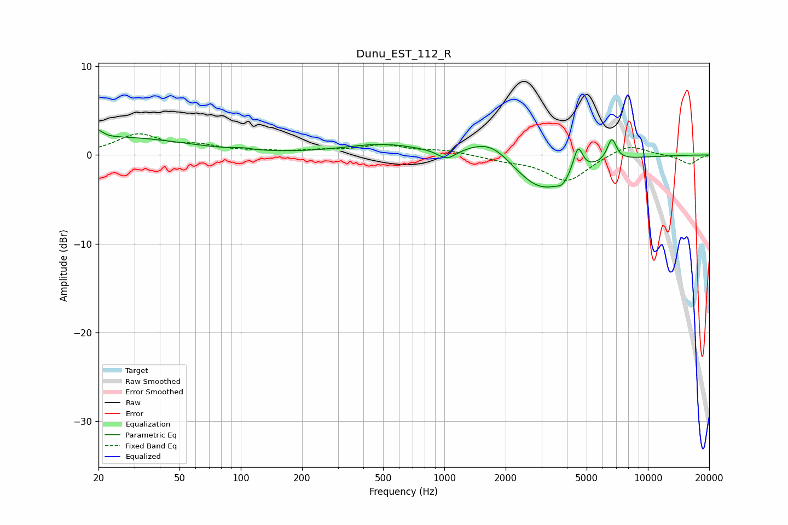

# Dunu_EST_112_R
See [usage instructions](https://github.com/jaakkopasanen/AutoEq#usage) for more options and info.

### Parametric EQs
Apply preamp of -2.8 dB when using parametric equalizer.

|   # | Type    |   Fc (Hz) |    Q |   Gain (dB) |
|-----|---------|-----------|------|-------------|
|   1 | Peaking |        20 | 5.99 |         0.9 |
|   2 | Peaking |        25 | 0.43 |         1.9 |
|   3 | Peaking |       102 | 3.21 |         0.2 |
|   4 | Peaking |       498 | 0.74 |         1.2 |
|   5 | Peaking |      1029 | 3.17 |        -1.1 |
|   6 | Peaking |      1698 | 1.25 |         2.5 |
|   7 | Peaking |      2988 | 0.95 |        -4.4 |
|   8 | Peaking |      3809 | 5.26 |        -0.7 |
|   9 | Peaking |      4536 | 6    |         3   |
|  10 | Peaking |      6647 | 5.97 |         2.5 |

### Fixed Band EQs
When using fixed band (also called graphic) equalizer, apply preamp of **-2.5 dB** (if available) and set gains manually with these parameters.

|   # | Type    |   Fc (Hz) |    Q |   Gain (dB) |
|-----|---------|-----------|------|-------------|
|   1 | Peaking |        31 | 1.41 |         2.2 |
|   2 | Peaking |        62 | 1.41 |         0.8 |
|   3 | Peaking |       125 | 1.41 |         0.3 |
|   4 | Peaking |       250 | 1.41 |         0.4 |
|   5 | Peaking |       500 | 1.41 |         1   |
|   6 | Peaking |      1000 | 1.41 |         0.5 |
|   7 | Peaking |      2000 | 1.41 |        -0.5 |
|   8 | Peaking |      4000 | 1.41 |        -3   |
|   9 | Peaking |      8000 | 1.41 |         1.3 |
|  10 | Peaking |     16000 | 1.41 |        -1.1 |

### Graphs

