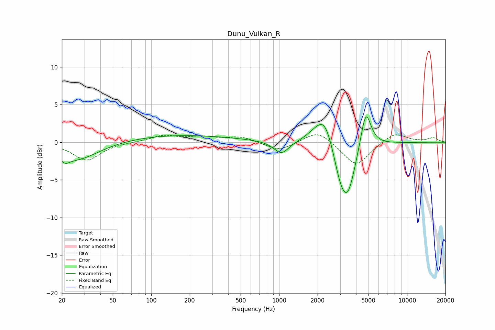

# Dunu_Vulkan_R
See [usage instructions](https://github.com/jaakkopasanen/AutoEq#usage) for more options and info.

### Parametric EQs
Apply preamp of -3.5 dB when using parametric equalizer.

|   # | Type    |   Fc (Hz) |    Q |   Gain (dB) |
|-----|---------|-----------|------|-------------|
|   1 | Peaking |        21 | 5.47 |        -2.2 |
|   2 | Peaking |        21 | 5.89 |         1.6 |
|   3 | Peaking |        25 | 0.79 |        -2.5 |
|   4 | Peaking |       157 | 0.31 |         1   |
|   5 | Peaking |      1041 | 2.43 |        -1.7 |
|   6 | Peaking |      1933 | 1.79 |         1.1 |
|   7 | Peaking |      2281 | 2.24 |         3.3 |
|   8 | Peaking |      2984 | 2.9  |        -2.3 |
|   9 | Peaking |      3431 | 2.21 |        -6.9 |
|  10 | Peaking |      4759 | 3.38 |         5.3 |

### Fixed Band EQs
When using fixed band (also called graphic) equalizer, apply preamp of **-1.1 dB** (if available) and set gains manually with these parameters.

|   # | Type    |   Fc (Hz) |    Q |   Gain (dB) |
|-----|---------|-----------|------|-------------|
|   1 | Peaking |        31 | 1.41 |        -2.4 |
|   2 | Peaking |        62 | 1.41 |         0   |
|   3 | Peaking |       125 | 1.41 |         0.9 |
|   4 | Peaking |       250 | 1.41 |         0.6 |
|   5 | Peaking |       500 | 1.41 |         0.7 |
|   6 | Peaking |      1000 | 1.41 |        -1.2 |
|   7 | Peaking |      2000 | 1.41 |         1.7 |
|   8 | Peaking |      4000 | 1.41 |        -3.2 |
|   9 | Peaking |      8000 | 1.41 |         1.4 |
|  10 | Peaking |     16000 | 1.41 |         0.6 |

### Graphs

