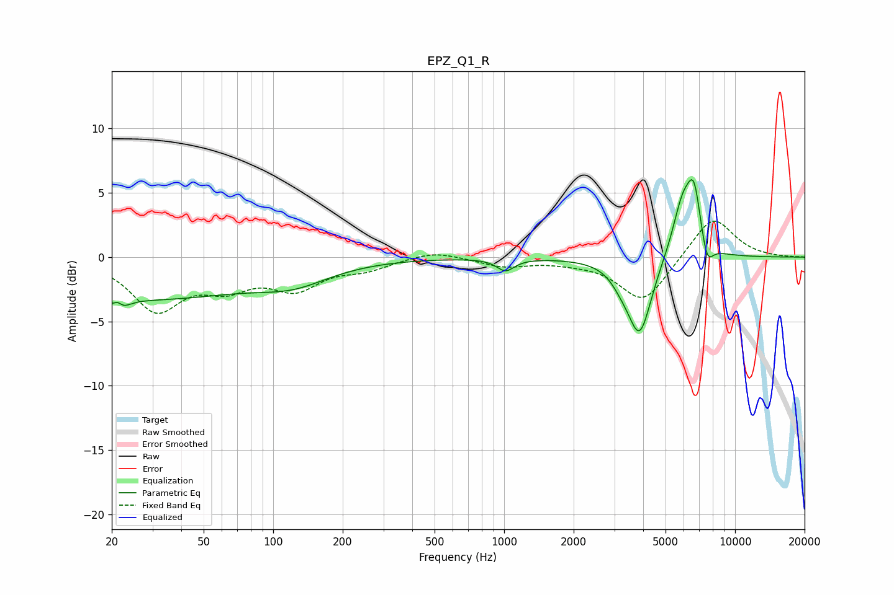

# EPZ_Q1_R
See [usage instructions](https://github.com/jaakkopasanen/AutoEq#usage) for more options and info.

### Parametric EQs
Apply preamp of -6.1 dB when using parametric equalizer.

|   # | Type    |   Fc (Hz) |    Q |   Gain (dB) |
|-----|---------|-----------|------|-------------|
|   1 | Peaking |        21 | 5.93 |         2.3 |
|   2 | Peaking |        21 | 4.62 |        -2.7 |
|   3 | Peaking |        28 | 0.3  |        -3.2 |
|   4 | Peaking |       123 | 0.9  |        -1.3 |
|   5 | Peaking |      1014 | 3.77 |        -1   |
|   6 | Peaking |      3209 | 3.11 |        -0.8 |
|   7 | Peaking |      3863 | 2.7  |        -6   |
|   8 | Peaking |      5942 | 2.96 |         4.3 |
|   9 | Peaking |      6650 | 4.64 |         4.1 |
|  10 | Peaking |      7561 | 5.32 |        -1.9 |

### Fixed Band EQs
When using fixed band (also called graphic) equalizer, apply preamp of **-2.9 dB** (if available) and set gains manually with these parameters.

|   # | Type    |   Fc (Hz) |    Q |   Gain (dB) |
|-----|---------|-----------|------|-------------|
|   1 | Peaking |        31 | 1.41 |        -3.9 |
|   2 | Peaking |        62 | 1.41 |        -1.9 |
|   3 | Peaking |       125 | 1.41 |        -2.2 |
|   4 | Peaking |       250 | 1.41 |        -0.8 |
|   5 | Peaking |       500 | 1.41 |         0.6 |
|   6 | Peaking |      1000 | 1.41 |        -0.7 |
|   7 | Peaking |      2000 | 1.41 |        -0.2 |
|   8 | Peaking |      4000 | 1.41 |        -3.5 |
|   9 | Peaking |      8000 | 1.41 |         3.3 |
|  10 | Peaking |     16000 | 1.41 |        -0   |

### Graphs

