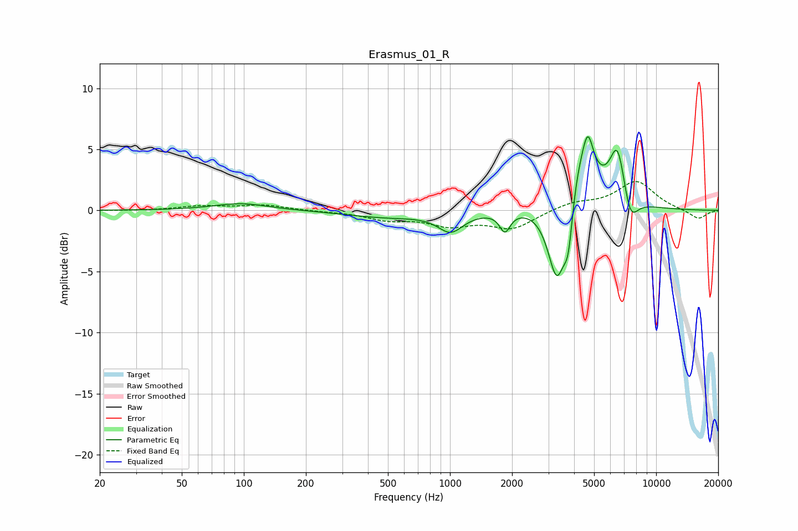

# Erasmus_01_R
See [usage instructions](https://github.com/jaakkopasanen/AutoEq#usage) for more options and info.

### Parametric EQs
Apply preamp of -6.1 dB when using parametric equalizer.

|   # | Type    |   Fc (Hz) |    Q |   Gain (dB) |
|-----|---------|-----------|------|-------------|
|   1 | Peaking |        97 | 1.07 |         0.6 |
|   2 | Peaking |       495 | 0.72 |        -0.5 |
|   3 | Peaking |      1007 | 2.31 |        -1.6 |
|   4 | Peaking |      1847 | 5.56 |        -1.6 |
|   5 | Peaking |      3316 | 2.9  |        -8.5 |
|   6 | Peaking |      3755 | 6    |        -4.4 |
|   7 | Peaking |      4040 | 1.63 |         6.3 |
|   8 | Peaking |      4665 | 5.56 |         2.9 |
|   9 | Peaking |      6504 | 3.59 |         4.6 |
|  10 | Peaking |      7471 | 3.71 |        -2.4 |

### Fixed Band EQs
When using fixed band (also called graphic) equalizer, apply preamp of **-2.5 dB** (if available) and set gains manually with these parameters.

|   # | Type    |   Fc (Hz) |    Q |   Gain (dB) |
|-----|---------|-----------|------|-------------|
|   1 | Peaking |        31 | 1.41 |        -0   |
|   2 | Peaking |        62 | 1.41 |         0.3 |
|   3 | Peaking |       125 | 1.41 |         0.4 |
|   4 | Peaking |       250 | 1.41 |        -0.1 |
|   5 | Peaking |       500 | 1.41 |        -0.7 |
|   6 | Peaking |      1000 | 1.41 |        -1.1 |
|   7 | Peaking |      2000 | 1.41 |        -1.4 |
|   8 | Peaking |      4000 | 1.41 |         0.6 |
|   9 | Peaking |      8000 | 1.41 |         2.4 |
|  10 | Peaking |     16000 | 1.41 |        -0.7 |

### Graphs

