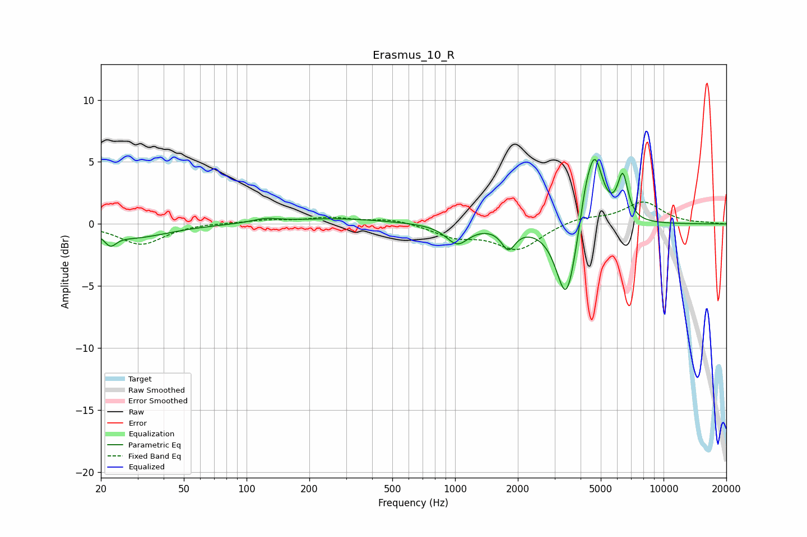

# Erasmus_10_R
See [usage instructions](https://github.com/jaakkopasanen/AutoEq#usage) for more options and info.

### Parametric EQs
Apply preamp of -5.3 dB when using parametric equalizer.

|   # | Type    |   Fc (Hz) |    Q |   Gain (dB) |
|-----|---------|-----------|------|-------------|
|   1 | Peaking |        22 | 5.22 |        -0.9 |
|   2 | Peaking |        29 | 0.85 |        -1.1 |
|   3 | Peaking |       123 | 2.18 |         0.3 |
|   4 | Peaking |       271 | 0.61 |         0.4 |
|   5 | Peaking |      1025 | 2.64 |        -1.6 |
|   6 | Peaking |      1803 | 4.32 |        -1.7 |
|   7 | Peaking |      3419 | 2.93 |        -6.4 |
|   8 | Peaking |      4214 | 4.92 |         1.7 |
|   9 | Peaking |      4672 | 3.47 |         5.6 |
|  10 | Peaking |      6375 | 5.41 |         3.6 |

### Fixed Band EQs
When using fixed band (also called graphic) equalizer, apply preamp of **-1.9 dB** (if available) and set gains manually with these parameters.

|   # | Type    |   Fc (Hz) |    Q |   Gain (dB) |
|-----|---------|-----------|------|-------------|
|   1 | Peaking |        31 | 1.41 |        -1.7 |
|   2 | Peaking |        62 | 1.41 |         0.1 |
|   3 | Peaking |       125 | 1.41 |         0.3 |
|   4 | Peaking |       250 | 1.41 |         0.5 |
|   5 | Peaking |       500 | 1.41 |         0.4 |
|   6 | Peaking |      1000 | 1.41 |        -0.9 |
|   7 | Peaking |      2000 | 1.41 |        -2   |
|   8 | Peaking |      4000 | 1.41 |         0.5 |
|   9 | Peaking |      8000 | 1.41 |         1.7 |
|  10 | Peaking |     16000 | 1.41 |         0.1 |

### Graphs

