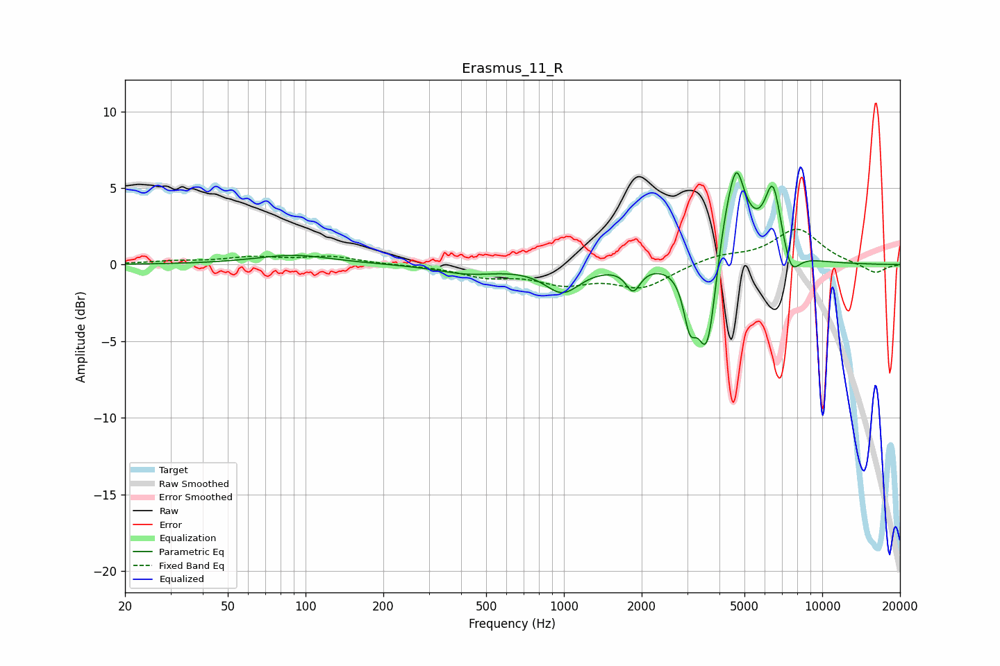

# Erasmus_11_R
See [usage instructions](https://github.com/jaakkopasanen/AutoEq#usage) for more options and info.

### Parametric EQs
Apply preamp of -6.1 dB when using parametric equalizer.

|   # | Type    |   Fc (Hz) |    Q |   Gain (dB) |
|-----|---------|-----------|------|-------------|
|   1 | Peaking |        90 | 0.95 |         0.6 |
|   2 | Peaking |       424 | 1.2  |        -0.6 |
|   3 | Peaking |       988 | 2.07 |        -1.7 |
|   4 | Peaking |      1854 | 5.12 |        -1.5 |
|   5 | Peaking |      3070 | 5.91 |        -2.9 |
|   6 | Peaking |      3600 | 3.31 |        -8.6 |
|   7 | Peaking |      4305 | 1.9  |         6.1 |
|   8 | Peaking |      4664 | 5.45 |         2.4 |
|   9 | Peaking |      6453 | 4.26 |         4.4 |
|  10 | Peaking |      7563 | 4.1  |        -1.8 |

### Fixed Band EQs
When using fixed band (also called graphic) equalizer, apply preamp of **-2.4 dB** (if available) and set gains manually with these parameters.

|   # | Type    |   Fc (Hz) |    Q |   Gain (dB) |
|-----|---------|-----------|------|-------------|
|   1 | Peaking |        31 | 1.41 |         0.2 |
|   2 | Peaking |        62 | 1.41 |         0.4 |
|   3 | Peaking |       125 | 1.41 |         0.5 |
|   4 | Peaking |       250 | 1.41 |        -0   |
|   5 | Peaking |       500 | 1.41 |        -0.7 |
|   6 | Peaking |      1000 | 1.41 |        -1.1 |
|   7 | Peaking |      2000 | 1.41 |        -1.4 |
|   8 | Peaking |      4000 | 1.41 |         0.6 |
|   9 | Peaking |      8000 | 1.41 |         2.3 |
|  10 | Peaking |     16000 | 1.41 |        -0.6 |

### Graphs

