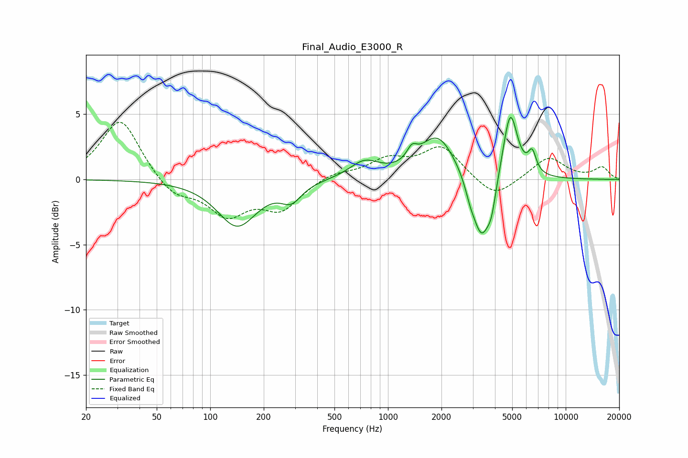

# Final_Audio_E3000_R
See [usage instructions](https://github.com/jaakkopasanen/AutoEq#usage) for more options and info.

### Parametric EQs
Apply preamp of -4.9 dB when using parametric equalizer.

|   # | Type    |   Fc (Hz) |    Q |   Gain (dB) |
|-----|---------|-----------|------|-------------|
|   1 | Peaking |       142 | 1.28 |        -3.5 |
|   2 | Peaking |       286 | 2.48 |        -1.3 |
|   3 | Peaking |       737 | 1.72 |         1.3 |
|   4 | Peaking |      1364 | 5.05 |         0.9 |
|   5 | Peaking |      1904 | 1.42 |         3.4 |
|   6 | Peaking |      2898 | 5.22 |        -0.8 |
|   7 | Peaking |      3359 | 2.79 |        -4.9 |
|   8 | Peaking |      3824 | 5.78 |        -1.6 |
|   9 | Peaking |      4875 | 3.45 |         5.3 |
|  10 | Peaking |      6476 | 6    |         1.6 |

### Fixed Band EQs
When using fixed band (also called graphic) equalizer, apply preamp of **-4.5 dB** (if available) and set gains manually with these parameters.

|   # | Type    |   Fc (Hz) |    Q |   Gain (dB) |
|-----|---------|-----------|------|-------------|
|   1 | Peaking |        31 | 1.41 |         4.7 |
|   2 | Peaking |        62 | 1.41 |        -1.4 |
|   3 | Peaking |       125 | 1.41 |        -2.6 |
|   4 | Peaking |       250 | 1.41 |        -2.2 |
|   5 | Peaking |       500 | 1.41 |         0.5 |
|   6 | Peaking |      1000 | 1.41 |         1.4 |
|   7 | Peaking |      2000 | 1.41 |         2.5 |
|   8 | Peaking |      4000 | 1.41 |        -1.6 |
|   9 | Peaking |      8000 | 1.41 |         1.7 |
|  10 | Peaking |     16000 | 1.41 |         0.9 |

### Graphs

