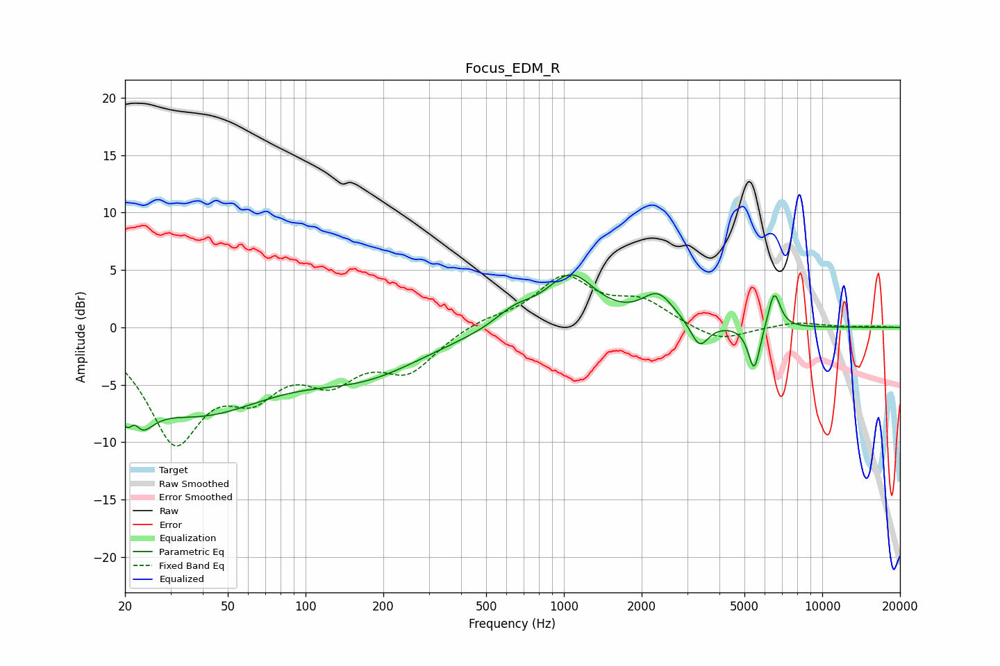

# Focus_EDM_R
See [usage instructions](https://github.com/jaakkopasanen/AutoEq#usage) for more options and info.

### Parametric EQs
Apply preamp of -4.7 dB when using parametric equalizer.

|   # | Type    |   Fc (Hz) |    Q |   Gain (dB) |
|-----|---------|-----------|------|-------------|
|   1 | Peaking |        21 | 2.9  |        -6.9 |
|   2 | Peaking |        22 | 5.47 |         3.5 |
|   3 | Peaking |        38 | 0.49 |        -6.8 |
|   4 | Peaking |       171 | 0.59 |        -3.4 |
|   5 | Peaking |       643 | 1.85 |         1.3 |
|   6 | Peaking |      1064 | 1.46 |         4.4 |
|   7 | Peaking |      2314 | 2.25 |         2.5 |
|   8 | Peaking |      3349 | 4.1  |        -2.2 |
|   9 | Peaking |      5452 | 6    |        -4   |
|  10 | Peaking |      6517 | 5.75 |         3.3 |

### Fixed Band EQs
When using fixed band (also called graphic) equalizer, apply preamp of **-4.6 dB** (if available) and set gains manually with these parameters.

|   # | Type    |   Fc (Hz) |    Q |   Gain (dB) |
|-----|---------|-----------|------|-------------|
|   1 | Peaking |        31 | 1.41 |        -9.4 |
|   2 | Peaking |        62 | 1.41 |        -4.3 |
|   3 | Peaking |       125 | 1.41 |        -3.7 |
|   4 | Peaking |       250 | 1.41 |        -3.4 |
|   5 | Peaking |       500 | 1.41 |         0.7 |
|   6 | Peaking |      1000 | 1.41 |         4.2 |
|   7 | Peaking |      2000 | 1.41 |         2.1 |
|   8 | Peaking |      4000 | 1.41 |        -1.3 |
|   9 | Peaking |      8000 | 1.41 |         0.5 |
|  10 | Peaking |     16000 | 1.41 |         0.1 |

### Graphs

